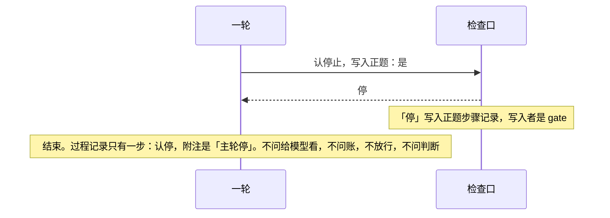
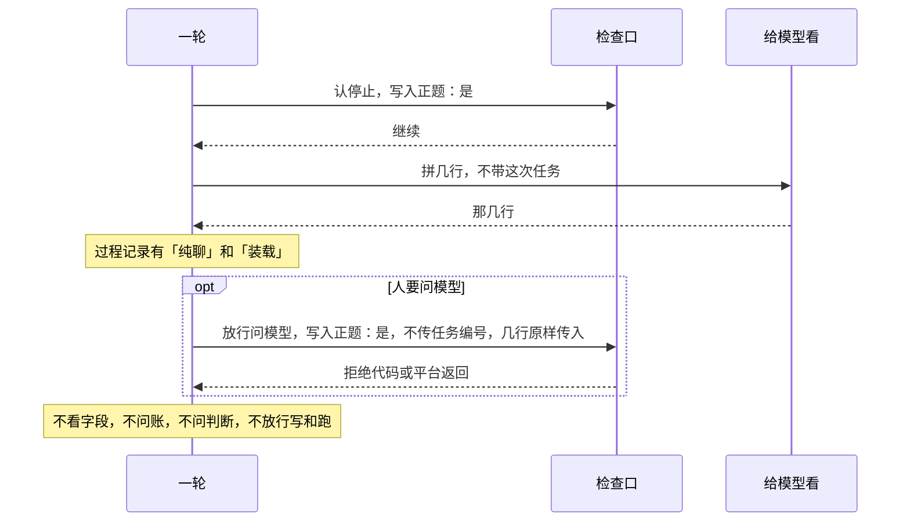
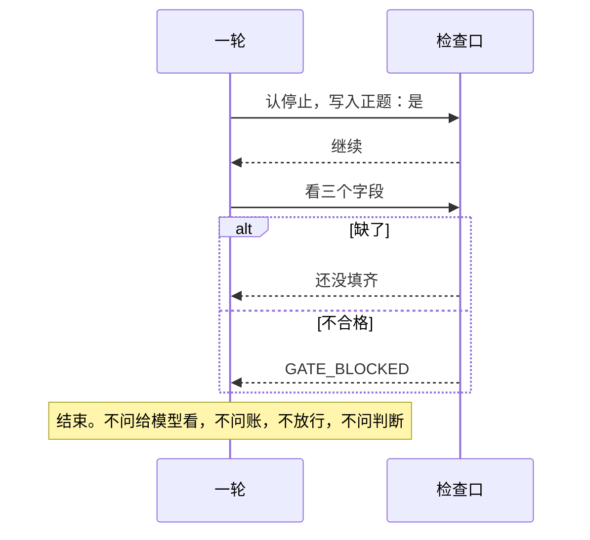
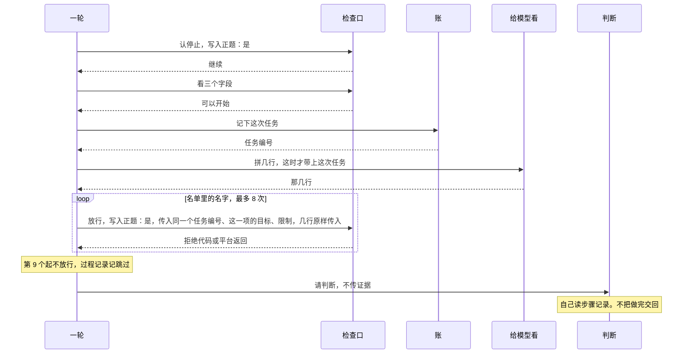
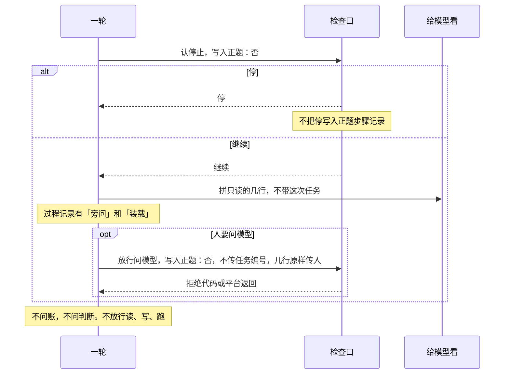

# 一轮

总规则：[`../rewrite-1.md`](../rewrite-1.md) 第 2.5、2.6、3、4 节。结构：[`../agent-os.md`](../agent-os.md)。

本文只写 `round`。它按固定次序去问账、检查口、给模型看、判断，只写过程记录。它不问回答，也不问做事。

步骤记录里的写入者仍是 `gate`、`base`、`judge`。`base` 是账写下的那一笔。

## 本文管什么

**包括**

- 正题：认停止 → 是不是只聊天 → 字段 → 记下这次任务 → 给模型看 → 经检查口放行最多 8 次 → 判断。
- 人标明只聊天：不看字段，不记任务，不判断，不放行写和跑。人要问才放行一次问模型。
- 旁边问比只聊天先。不写正题的步骤记录，不另开一本，不判断，不放行读、写、跑。
- 第 9 个起不放行，过程记录记「跳过」。满 8 次不是做完。
- 判断不把做完交回。模型说的那句话不写入能力交回。
- 正题不看 `askModel`。正题要问模型，名字必须在 `calls` 里。`askModel` 只用于还没停的只聊天和旁边问。
- 停、是不是只聊天、三个字段，都不由模型的话来定。只聊天只看人有没有标明。
- 放行时，一轮把给模型看交回的几行原样交给检查口。读、写、跑还带上这一项的目标；限制用三个字段里的限制。
- 认停止和放行时，一轮另交一句：这次写不写入正题的步骤记录。旁边问一律传不写。检查口照这句做，不自己分辨正题、只聊天、旁边问。

**不包括**

- 停止词怎么对上，见 [回答.md](./回答.md)
- 费用、点头、范围怎么回答，见 [回答.md](./回答.md)
- 问模型、读、写、跑怎么做，见 [做事.md](./做事.md)
- 给模型的几行怎么拼，见 [给模型看.md](./给模型看.md)
- 怎样算做完，见 [判断.md](./判断.md)
- 外面怎么交、怎么读回，见 [对外.md](./对外.md)
- 同一次输入再提交、同一个任务编号再开跑，不在本文
- 执行登记里面长什么样、哪一种输入会写下它，不在本文。没有登记就不能出现「已安排」，见 V-11

## 时序

图里没出现的包，这一支就没有问它。

正题，已经停：

正题，只聊天，还没停：

正题，字段没过：

正题，三个字段合格：

旁边问：

过程记录只由一轮写。步骤名只有这九个：认停、旁问、纯聊、未开跑、记下这一件、装载、放行、跳过、交判定。每步可以带附注。附注不是另一个步骤名。

旁边问并且停：步骤名仍是认停，附注是「旁问停」。正题停：附注是「主轮停」。没停：附注是「继续」。旁边问还没停，另有一步「旁问」，并且有「装载」。只聊天还没停，有一步「纯聊」，并且有「装载」。字段没过，有一步「未开跑」，然后结束，没有装载。放行只记能力名，加上结果种类或拒绝代码。

## 验收

从步骤记录读回来。过程从过程记录读回来。没出现的记录，就是没有那一笔。

| 编号 | 输入 | 必须见到 |
|------|------|----------|
| V-01 | 正题，`stopHit` 为真 | 步骤记录有「停」，写入者是 `gate`。没有问模型。没有做完，也没有没做完。过程记录只有一步：认停，附注是「主轮停」 |
| V-02 | 标明只聊天，不要问模型，没有三个字段 | 没有「待补全」，没有 `GATE_BLOCKED`，没有做完，没有没做完，没有写东西，没有跑命令。过程记录有「纯聊」和「装载」 |
| V-03 | 没有标明只聊天，没有提交「怎样算做完」 | 有「待补全」，写入者是 `gate`。没有调用能力。没有做完，没有没做完。这不是 `GATE_BLOCKED`。过程记录有「未开跑」 |
| V-04 | 要做什么等于 `按上面说的做`，另外两个字段是普通非空句，也不在不合格原句里 | `GATE_BLOCKED`，写入者是 `gate`。没有调用能力。没有做完，没有没做完 |
| V-05 | 三个字段是普通非空句，`calls` 里有一个不在已装名单上的名字 | `NOT_INSTALLED`，写入者是 `gate`。这次任务的编号写入者是 `base`。没做完，写入者是 `judge` |
| V-06 | 三个字段合格，`calls` 是空的，模型说「已完成」 | 没有能力交回的结果。没做完，写入者是 `judge`。没有做完 |
| V-07 | 三个字段合格，`calls` 一个名字，不是问模型，而且已经装上；能力交回成功 | 能力交回的结果写入者是 `gate`，抄的编号等于这次任务的编号。做完，写入者是 `judge`。过程记录里能看见装了固定说明和这次任务，并且标明不是人说的。步骤记录里没有「装载」 |
| V-08 | 同 V-07，并且能力交回的正文里还有另一个编号 | 抄的编号仍等于这次任务的编号。做完，写入者是 `judge` |
| V-09 | 同 V-07，但能力交回失败，结果代码是 `FAILED`，「怎样算做完」不是 `FAILED` | 没做完，写入者是 `judge` |
| V-10 | 三个字段合格，`calls` 有 8 个都不在已装名单上的名字 | 8 条 `NOT_INSTALLED`。没做完，写入者是 `judge` |
| V-11 | 三个字段合格，`calls` 是空的，没有执行登记，模型说「已安排」 | 没有「已安排」。没做完，写入者是 `judge`。原因是没有对得上的能力交回结果，不是因为没有执行登记 |
| V-12 | 旁边问一句，不要问模型，也没有停 | 正题的步骤记录没有新的这次任务，没有读、写、跑命令，没有做完，没有没做完。过程记录有「旁问」和「装载」 |
| V-13 | 任何会写步骤记录的情况 | 「谁」和这次任务编号的写入者是 `base`。停止、还没填齐、拒绝、能力交回的结果、执行登记、已安排，写入者是 `gate`。做完或没做完只在做了判断时出现，写入者是 `judge` |
| V-14 | 标明只聊天，要问模型，费用没装，问模型已装 | `GATE_BLOCKED`，写入者是 `gate`。没有能力交回的结果。没有做完，没有没做完。过程记录有「纯聊」和「装载」 |
| V-15 | 旁边问，并且 `stopHit` 为真 | 正题的步骤记录没有「停」，没有这次任务，没有做完，没有没做完。过程记录只有一步：认停，附注是「旁问停」 |
| V-16 | 要做什么是三个空格，另外两个字段是普通非空句 | `GATE_BLOCKED`。没有「待补全」。没有调用能力。没有做完，没有没做完 |
| V-17 | 怎样算做完等于 `完成`，另外两个字段是普通非空句 | `GATE_BLOCKED`。没有调用能力。没有做完，没有没做完 |
| V-18 | 三个字段合格，`calls` 只有问模型，问模型已装，费用没装 | `GATE_BLOCKED`。没有 `NOT_INSTALLED`。没有能力交回的结果。没做完，写入者是 `judge` |
| V-19 | 三个字段合格，`calls` 只有问模型，已装名单是空的，费用没装 | `NOT_INSTALLED`。没有 `GATE_BLOCKED`。没做完，写入者是 `judge` |
| V-20 | 三个字段合格，`calls` 有 9 个都不在已装名单上的名字 | 前 8 个各有 `NOT_INSTALLED`。第 9 个没有拒绝代码，也没有能力交回的结果。没做完，写入者是 `judge` |
| V-21 | 旁边问，要问模型，费用没装，问模型已装 | 正题的步骤记录没有拒绝代码，没有能力交回的结果，没有这次任务，没有做完。过程记录有「旁问」和「装载」，并且放行记着 `GATE_BLOCKED` |
| V-22 | 标明只聊天，要问模型，费用已装，问模型已装，能力交回成功并且正文有字 | 能力交回的结果写入者是 `gate`，没有抄任务编号。没有做完，没有没做完。过程记录有「纯聊」和「装载」 |
| V-23 | 三个字段合格，`calls` 只有问模型，问模型已装，费用已装，能力交回成功并且正文有字 | 有能力交回的结果，种类是成功，并且抄了编号。没有做完。没做完，写入者是 `judge` |
| V-24 | 旁边问，同时标明只聊天，要问模型，费用已装，问模型已装 | 正题的步骤记录没有能力交回的结果，没有这次任务，没有做完。过程记录有「旁问」和「装载」，没有「纯聊」 |
| V-25 | 三个字段合格，`calls` 一个已装的、不是问模型的名字，能力交回成功 | 过程记录按顺序是：认停并且继续、记下这一件、装载（固定说明和这次任务都标明不是人说的）、放行并且结果是成功、交判定。步骤记录里没有「装载」。做完仍在步骤记录里 |
| V-26 | 三个字段合格，`calls` 有 9 个都不在已装名单上的名字 | 过程记录有 8 次放行。第 9 个是跳过。步骤记录里没有第 9 个 |
| V-27 | 同 V-21 | 与 V-21 是同一条，不另测。必须见到的内容以 V-21 为准 |

外面交进什么、缺省是什么，见 [对外.md](./对外.md)。结果种类只有成功、失败、拒绝、超时。失败的例子用 `FAILED`。
