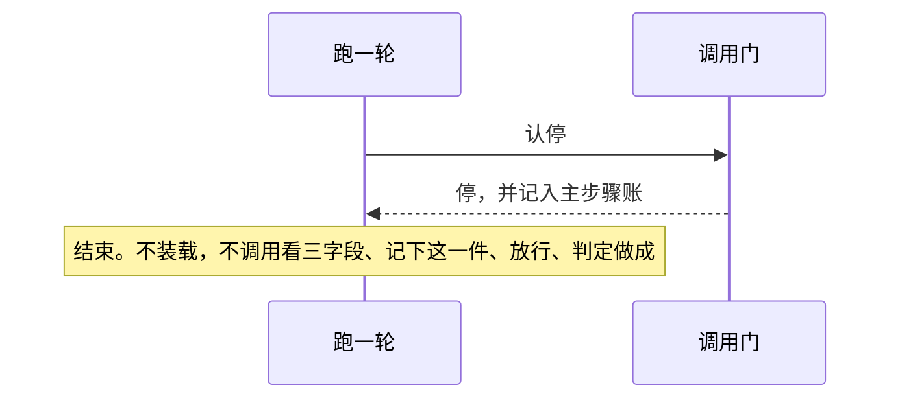
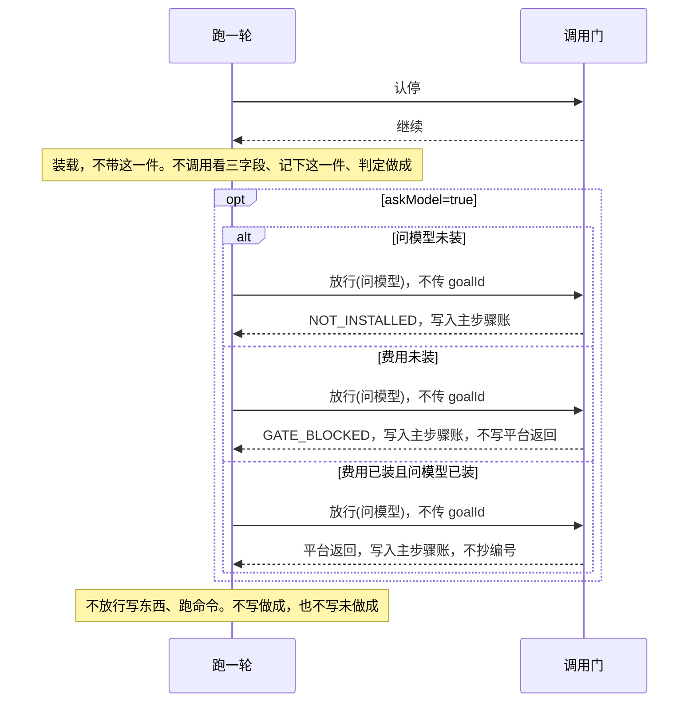
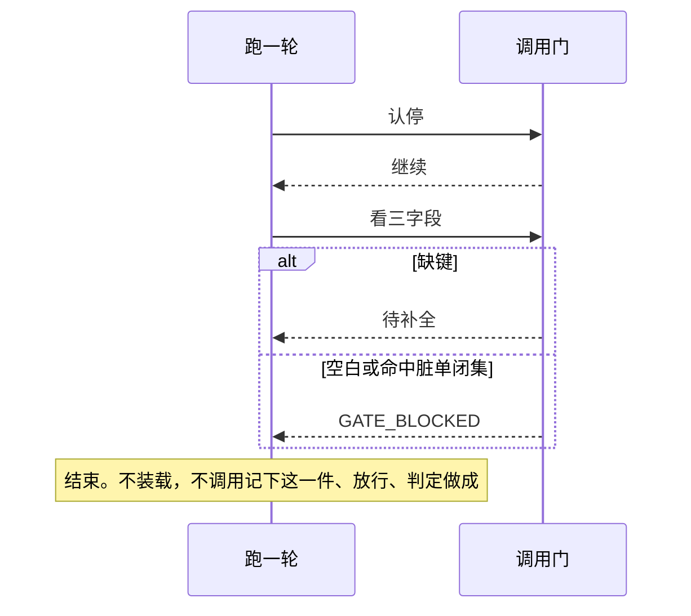
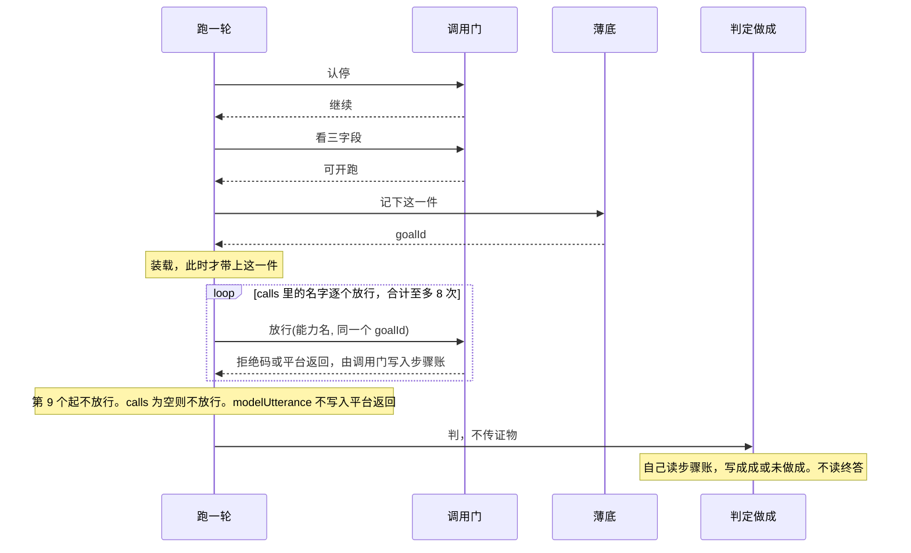
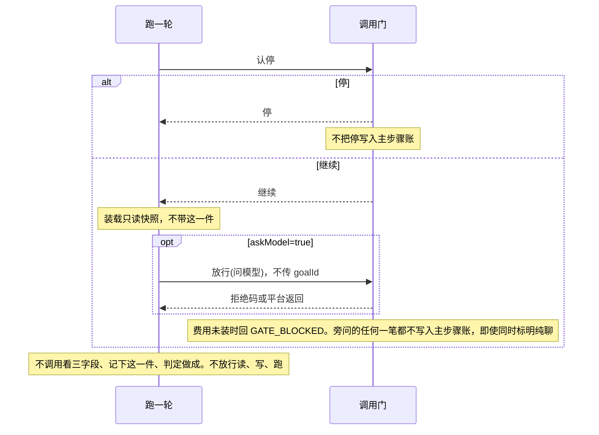

# 一轮闭环

宪法：[`../rewrite-1.md`](../rewrite-1.md) §2.5、§2.6、§3、§4、§6。  
本文件只覆盖四个内核口：薄底、调用门、跑一轮（含装载）、判定做成。  
费用额度、点头时限、读/写/跑的具体动作、记忆召回，各有自己的 spec。

期望值取不到的不编。止意词表、纯聊界面词未钉死的，测试用下面的标记和样例句，不自己加词。脏单闭集已在「钉死」。

## 范围

**包含**

- 主轮顺序：停认 → 纯聊标记 → 待补全或脏单 → 记下这一件 → 装载 → 经门调用 → 判定做成（判定自己读账；跑一轮自己不写账）
- 三字段只由人提交；这一件上的 `goalId` 由薄底在开跑时分配；调用门只在放行传入了编号时才抄进平台返回
- 做成只认：非问模型的平台返回上，抄写的编号等于这一件上的 `goalId`，且不是失败、拒绝、超时（第 7 条除外）。不看句柄。问模型的成功返回不能撑起做成
- 没套判定时，账上既无做成也无未做成
- 旁问：只读快照，不进主步骤账，不新记「这一件」，不调读/写/跑，不套判定做成
- 步骤账可独立读回

**不包含**

- 费用够不够的算法（见《问模型》）
- 点头等多少秒（见《点头》）
- 文件与进程怎么执行（见《范围内做事》）
- 从模型输出里再解析出新的调用（本 spec 的调用只来自人提交的 `calls`）

## 四个口

名字只用这四个。Java 类型名、方法名未定。

只有跑一轮发起认停、看三字段、记下这一件、放行、判。调用门不调用薄底和判定。薄底不调用另外两个口。判定做成不调用调用门，也不调用薄底的记下这一件；它自己读步骤账。能力件不调用这四个口来写账。落账是该口自己的动作，没有「请别的口帮我写一笔」。四个口都不接受调用方传入的 `writer`。

| 口 | 收 | 回 | 不许 |
|----|----|----|------|
| 跑一轮 | `entry`（`main` 或 `side`，缺省 `main`）、`pureChat`、`stopHit`、`feeInstalled`（缺省 true）、`askModel`（缺省 false）、`installed`（缺省空）、三字段、`calls`、`modelUtterance`（可缺） | 无业务回执 | 不写账；不分配 `goalId`；不向判定转交证物；不接收做成与否；不接收放行结果。主轮忽略 `askModel`，问模型必须在 `calls` 里。`entry=side` 时忽略纯聊对主账的写入 |
| 薄底 | `记下这一件(goal, limit, doneWhen)`；另有只读：`读这一件`、`读步骤账` | `记下这一件` 回 `goalId`，并记在这一件上，`writer=base` | 不查脏单；不写停、待补全、脏单、拒绝码、平台返回、做成、未做成；不调用能力件 |
| 调用门 | `认停(stopHit)`；`看三字段(goal, limit, doneWhen)`；`放行(能力名, goalId 可缺)` | `认停` 回停或继续。`看三字段`：缺键回待补全；已提交但去空白后为空，或命中脏单闭集，回 `GATE_BLOCKED`；否则可开跑。`放行` 回拒绝码或平台返回 | 不分配 `goalId`；不写做成、未做成。传入了 `goalId` 时，平台返回上的抄写编号必须等于它，`writer` 仍是 `gate`。没传入时不抄编号。正文里的编号、平台码、`writer` 一律无效 |
| 判定做成 | 无证物参数。自己读步骤账里的这一件、`writer=gate` 的平台返回、句柄、已安排 | 无回执。做成或未做成只写入步骤账，`writer=judge` | 不写 `goalId`、拒绝码、平台返回、句柄、已安排；不读终答正文和 `modelUtterance`；不调用能力件 |

跑一轮按 §2.5 的顺序调用，自己不落笔：

1. `认停`。主轮回停则结束，调用门把停记入主步骤账。不调用 `看三字段`、`记下这一件`、`放行`、判定做成。旁问回停也结束，但不把停写入主步骤账。
2. `entry=main` 且 `pureChat=true`：不调用 `看三字段`、`记下这一件`、判定做成，也不 `放行` 写东西和跑命令。`askModel=true` 时 `放行` 一次问模型，不传 `goalId`。这笔平台返回或拒绝码写入主步骤账。
3. `entry=main` 且未标明纯聊：调用 `看三字段`。回待补全或 `GATE_BLOCKED` 则结束，不调用 `记下这一件`、`放行`、判定做成。
4. 回可开跑：先调用 `记下这一件`，拿到 `goalId`，再装载（此时才带上这一件），再对 `calls` 里的名字调用 `放行`，把这个 `goalId` 原样传入。问模型若在 `calls` 里，走同一次放行。
5. 记下这一件之后，对 `calls` 放行，合计至多 8 次，然后调用判定做成一次，不传证物。第 9 个起不放行、不写拒绝码、不写平台返回。满 8 次不是另一次判定。`modelUtterance` 不写入平台返回。
6. `entry=side`：先于纯聊。不调用 `看三字段`、`记下这一件`、判定做成，也不 `放行` 读东西、写东西、跑命令。即使 `pureChat=true`，也不把任何一笔写入主步骤账。`askModel=true` 时 `放行` 一次问模型，且不传 `goalId`。本 spec 不另开旁问账。

`放行` 的 `goalId` 可以不传。检查顺序：名字未装上先回 `NOT_INSTALLED`；名字已装但费用未装、且这次是问模型，回 `GATE_BLOCKED`，不写平台返回。传入了 `goalId` 才抄编号。下面「钉死」是这些词的唯一定义。

## 钉死

费用以 [`../rewrite-1.md`](../rewrite-1.md) §2.3、§2.4、§7 为准：没装费用就拦住问模型。旧稿「没装就不限额」作废。额度够不够仍不在本文。

| 词 | 含义 |
|----|------|
| 缺字段 | 三个键里有键没提交。这是待补全，不是脏单 |
| 空白字段 | 键已提交，去掉空白后是空串。这是脏单，拒绝码 `GATE_BLOCKED`。只去掉空白，不改大小写、标点、全半角 |
| 脏单闭集 | 只此三则，整段相等：去空白后为空；`goal` 等于 `按上面说的做`；`doneWhen` 等于 `完成` 或 `done`。`Done`、`完成。` 不是脏单 |
| 平台返回 | 只有调用门能写，`writer=gate`。调用门根据能力件交回的结果自己写，不从跑一轮接收种类、平台码或正文。能力件正文不能伪造编号、平台码或 `writer`。结果种类只有成功、失败、拒绝、超时。问模型的成功返回可以入账，不得支撑做成 |
| 拒绝码 | 只此四个：`USER_DENIED`、`NOT_INSTALLED`、`APPROVAL_TIMEOUT`、`GATE_BLOCKED`。问模型先看装没装，未装是 `NOT_INSTALLED`；装了但费用未装才是 `GATE_BLOCKED` |
| 句柄 | 调用门写的一笔，`writer=gate`，表示平台登记了一个执行位。内部长什么样不在本文 |
| 已安排 | 只能由调用门写。本轮已经有句柄才允许写。没有句柄，账上不得出现已安排。做成不看句柄。判定不读终答正文 |
| 纯聊的平台返回 | 写入主步骤账，`writer=gate`，不抄编号。不写做成，也不写未做成 |
| 旁问 | 先于纯聊。不写主步骤账，也不另开旁问账。`pureChat=true` 同时成立时，仍不写主账。快照是装载时从真源再灌的只读投影，不能当做成证物 |
| 装载 | 把总则和可见投影放进模型可见序列，不是装配组件。不失败，不写步骤账。人在账上看见的是调用、拒绝和判定 |
| 8 次 | 记下这一件之后，问模型与工具放行合计最多 8 次，然后判定一次。第 9 个起当没发生 |
| `stopHit` | 缺省 false。本文不匹配词表，测试注入。归一化见宪法 §6.1 |
| `modelUtterance` | 只用来证明不得写入平台返回、不得当证物 |
| `askModel` | 缺省 false。true 时，未停的纯聊或旁问放行一次问模型。主轮忽略它，主轮的问模型必须在 `calls` 里 |

同一时刻只允许一笔追加成功。用锁还是队列，不在本文。同一次输入重复提交、同一编号再开跑，不在本文。`doneWhen` 整段等于平台码时，失败返回可以支撑做成，这条维持宪法，本文不改。

## 时序

每张图都从认停画起，画到这一支结束。装载画在跑一轮自己身上，不另立一口。没出现的口，就是这一支没有调用它。判定做成不把做成或未做成返回给跑一轮。

停（仅主轮；`stopHit=true`）：

纯聊（`entry=main`，`pureChat=true`，未停）：

待补全或脏单（`entry=main`，未标明纯聊，未停）：

开跑（`entry=main`，`看三字段` 回了可开跑）：

旁问（`entry=side`）：

## 输入（测试认这些）

| 字段 | 含义 |
|------|------|
| `entry` | `main` 主轮，`side` 旁问。缺省 = `main` |
| `pureChat` | `true` 才是纯聊。缺省或 false = 未标明 |
| `stopHit` | 缺省 false。true 表示本轮原话已被止意白名单认定。本文不匹配词表 |
| `feeInstalled` | 缺省 true。false = 没装费用 |
| `askModel` | 缺省 false。true 时，未停的纯聊或旁问放行一次问模型。主轮忽略它 |
| `installed` | 已装能力名。缺省为空。`calls` 里不在此列的名字视为未装。纯聊、旁问看「问模型」在不在此列 |
| `goal` `limit` `doneWhen` | 人提交的三字段。缺键 = 待补全。键在但去空白后为空 = 脏单 |
| `calls` | 人提交的能力名列表。开跑后只放行这些名字，最多 8 个。空列表 = 不放行。主轮问模型必须在这个名单里 |
| `modelUtterance` | 可缺。只用来证明不得当证物 |

`resultKind`、`resultCode`、`bodyText` 不是跑一轮的参数，也不是 `放行` 的参数。测试在能力件交回调用门的结果上放置它们。调用门自己写成平台返回。

| 测试注入 | 含义 |
|----------|------|
| `resultKind` | 能力件交回的种类：`成功`、`失败`、`拒绝`、`超时`。缺省 `成功` |
| `resultCode` | 可缺。能力件交回的平台码，失败样例只用 `FAILED`。正文里的同字无效 |
| `bodyText` | 可缺。能力件交回的正文。不得当成抄写编号或平台码 |

程序不得调用模型来判断是不是纯聊、是不是要停、三字段该填什么。

## 谁写步骤账

每条步骤账带 `writer`。跑一轮不得写账。同一时刻只有一个写入者追加。

| 字段 | `writer` |
|------|----------|
| 待补全、脏单、停、拒绝码、平台返回、句柄、已安排 | `gate` |
| 这一件上的 `goalId` | `base` |
| 做成 / 未做成 | `judge`（只有套了判定才有这两笔） |

没套判定时，不写做成，也不写未做成。传入了 `goalId` 时，平台返回上的编号由 `gate` 抄写，且必须等于传入值，不把这笔的 `writer` 记成 `base`。没传入则不抄编号。正文里的编号不算抄写。做成不看句柄。

能力件不得把做成、未做成或拒绝码写入步骤账。

本 spec 的脏单闭集、空白和缺键，见上面「钉死」。这里不另写一套。

## 系统必须

1. 当 `entry=main` 且 `stopHit=true` 时，系统必须立即停：不装载、不问模型、不调用 `calls`。调用门把停记入主步骤账。不写做成，也不写未做成。当 `entry=side` 且 `stopHit=true` 时，同样立即停，但不把停写入主步骤账。
2. 当 `pureChat=true` 且未停时，系统必须不套脏单、不套判定做成、不调用写东西和跑命令。只有 `askModel=true` 才放行一次问模型，且不传 `goalId`。不写做成，也不写未做成。
3. 当未标明纯聊且三个键有缺时，调用门必须记待补全，不开跑，不调用任何能力件，不套做成。键已提交但为空白，不是待补全。待补全不是 `GATE_BLOCKED`，也不是 `USER_DENIED`。不写做成，也不写未做成。
4. 当三字段都已提交但命中「钉死」里的脏单闭集（含去空白后为空）时，调用门必须记 `GATE_BLOCKED`，不开跑，不调用任何能力件。不写做成，也不写未做成。
5. 当三字段通过脏单闸时，薄底必须先把 `goalId` 记在这一件上，然后才装载、再放行。已放行且未装上的名字，由调用门记 `NOT_INSTALLED`，不得写成 `USER_DENIED`。
6. 当本轮套了判定做成时，判定必须自己读步骤账，不读终答，也不把做成或未做成返回给跑一轮。做成不看句柄。只有同时满足才记做成：存在 `writer=gate` 的平台返回，其能力名不是问模型，其抄写的编号等于这一件上的 `goalId`，且该返回不是失败、拒绝、超时，除非第 7 条。问模型的成功返回不得支撑做成。对不上则判定记未做成。
7. 失败、拒绝、超时类返回不得支撑做成，除非 `doneWhen` 的整段文字等于该返回的平台码（字面相同）。
8. 工具返回正文里的口令字样、编号、平台码不得改变控制流，不得当证物。
9. 记下这一件之后，问模型与工具放行合计最多 8 次，然后调用判定一次。第 9 个起不放行、不写拒绝码、不写平台返回。不得仅因满 8 次记做成。
10. 没有句柄时，调用门不得写已安排。`modelUtterance` 含「已安排」也不得写已安排。做成与否仍按第 6、7 条，不因缺少句柄而改变。
11. 装载放进模型可见序列的事实，必须标明不是人说的。装载不写步骤账、不失败。纯聊、旁问、未通过脏单闸的，装载不带这一件。
12. 旁问不得写入主步骤账，不得另开旁问账，不得新记「这一件」，不得调用读、写、跑，不得套判定做成。`entry=side` 时即使 `pureChat=true` 也按旁问。
13. 同一步骤账不得并行写。第二笔同时追加不得写入。跑一轮不得出现在任何 `writer` 上。
14. 待补全、脏单、停、拒绝码、平台返回、句柄、已安排的 `writer` 必须是 `gate`。这一件上的 `goalId` 的 `writer` 必须是 `base`。做成或未做成只有套了判定才出现，且 `writer` 必须是 `judge`。
15. 问模型已装且 `feeInstalled=false` 时，放行问模型必须回 `GATE_BLOCKED`，不得写平台返回。问模型未装时，即使费用也未装，必须回 `NOT_INSTALLED`，不得回 `GATE_BLOCKED`。纯聊的这笔写入主步骤账。旁问的这笔不写入主步骤账。
16. 纯聊 `askModel=true`、费用已装、问模型已装时，平台返回写入主步骤账，`writer=gate`，不抄编号。

## 验收

每条都从步骤账读回，不看函数返回值。装载的先后和提示词全文不在账上，验收不假装能读出来。没出现的记录，就是没有那一笔。

| 编号 | 输入 | 步骤账必须见到 |
|------|------|----------------|
| V-01 | `entry=main`，`stopHit=true` | 停，且 `writer=gate`；无问模型；无做成记录；无未做成记录 |
| V-02 | `pureChat=true`，无三字段 | 无待补全；无脏单；无做成记录；无未做成记录；无写、无跑 |
| V-03 | 未标明纯聊，无 `doneWhen` 这个键 | 待补全且 `writer=gate`；无能力件调用；无做成记录；无未做成记录 |
| V-04 | `goal=按上面说的做`，另两字段非空且不在闭集 | `GATE_BLOCKED` 且 `writer=gate`；无能力件调用；无做成记录；无未做成记录 |
| V-05 | 三字段为普通非空句，`calls` 含一个不在 `installed` 里的名字 | `NOT_INSTALLED` 且 `writer=gate`；这一件 `goalId` 的 `writer=base`；未做成且 `writer=judge` |
| V-06 | 三字段通过脏单闸，`calls` 为空，`modelUtterance=已完成` | 无平台返回；未做成且 `writer=judge`；无做成记录 |
| V-07 | 三字段通过脏单闸，`calls` 一个名字，不是问模型，且在 `installed` 里；能力件交回 `resultKind=成功` | 平台返回 `writer=gate`，抄写编号等于这一件 `goalId`；做成且 `writer=judge` |
| V-08 | 同 V-07，且能力件交回的 `bodyText` 里另有一个编号 | 抄写的编号仍等于这一件 `goalId`；做成且 `writer=judge` |
| V-09 | 同 V-07，但能力件交回 `resultKind=失败`，`resultCode=FAILED`，`doneWhen` 不是 `FAILED` | 未做成且 `writer=judge` |
| V-10 | 三字段通过脏单闸，`calls` 有 8 个都不在 `installed` 里的名字 | 8 笔 `NOT_INSTALLED`；未做成且 `writer=judge` |
| V-11 | 三字段通过脏单闸，`calls` 为空，无句柄，`modelUtterance=已安排` | 无已安排；未做成且 `writer=judge`（因为没有对得上的平台返回，不是因为没有句柄） |
| V-12 | 旁问 | 主步骤账无新「这一件」；无读/写/跑；无做成记录；无未做成记录 |
| V-13 | 任一会写账的场景 | 停、待补全、脏单、拒绝码、平台返回、句柄、已安排的 `writer=gate`；这一件 `goalId` 的 `writer=base`；做成或未做成仅在套了判定时出现，且 `writer=judge` |
| V-14 | `pureChat=true`，`askModel=true`，`feeInstalled=false`，`installed` 含问模型 | `GATE_BLOCKED` 且 `writer=gate`；无平台返回；无做成记录；无未做成记录 |
| V-15 | `entry=side`，`stopHit=true` | 主步骤账无停；无这一件；无做成记录；无未做成记录 |
| V-16 | `goal` 为三个空格，另两字段为普通非空句 | `GATE_BLOCKED`；无待补全；无能力件调用；无做成记录；无未做成记录 |
| V-17 | `doneWhen=完成`，另两字段为普通非空句 | `GATE_BLOCKED`；无能力件调用；无做成记录；无未做成记录 |
| V-18 | 三字段通过脏单闸，`calls` 只有问模型，问模型在 `installed` 里，`feeInstalled=false` | `GATE_BLOCKED`；无 `NOT_INSTALLED`；无平台返回；未做成且 `writer=judge` |
| V-19 | 三字段通过脏单闸，`calls` 只有问模型，`installed` 为空，`feeInstalled=false` | `NOT_INSTALLED`；无 `GATE_BLOCKED`；未做成且 `writer=judge` |
| V-20 | 三字段通过脏单闸，`calls` 有 9 个都不在 `installed` 里的名字 | 前 8 个各有 `NOT_INSTALLED`；第 9 个无拒绝码、无平台返回；未做成且 `writer=judge` |
| V-21 | `entry=side`，`askModel=true`，`feeInstalled=false`，`installed` 含问模型 | 主步骤账无拒绝码、无平台返回、无这一件。只证明主账没被写入，不证明旁问内部拦过 |
| V-22 | `pureChat=true`，`askModel=true`，`feeInstalled=true`，`installed` 含问模型；能力件交回 `resultKind=成功` | 平台返回 `writer=gate`，且无抄写编号；无做成记录；无未做成记录 |
| V-23 | 三字段通过脏单闸，`calls` 只有问模型，问模型在 `installed` 里，费用已装；能力件交回 `resultKind=成功` | 有平台返回且抄了编号；无做成记录；未做成且 `writer=judge` |
| V-24 | `entry=side`，`pureChat=true`，`askModel=true`，费用已装，`installed` 含问模型 | 主步骤账无平台返回、无这一件、无做成记录 |

## 尚未钉死（测试不得自行补词）

- 止意白名单有哪些句子（测试注入 `stopHit`；归一化见宪法 §6.1）
- 人在界面上用哪个词表示纯聊（测试注入 `pureChat`）
- 脏单闭集以外的指针句、回执句
- 总则短颁布的全文
- 句柄内部长什么样
- 压缩入账的写入者
- 同时追加用锁还是队列
- 重复提交、同一编号再开跑
- 平台码全表。测试里失败只用 `FAILED`
- 点头时限、额度算法、范围语法
