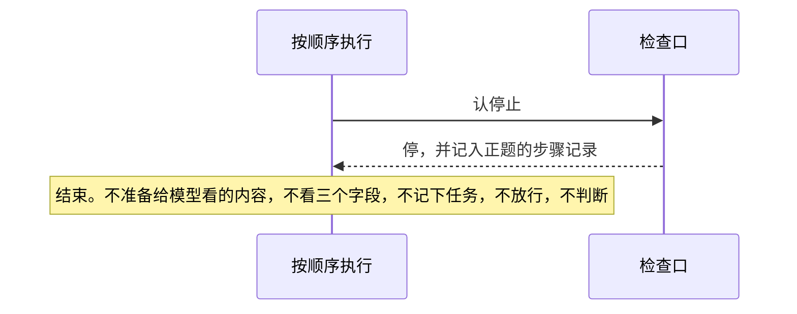
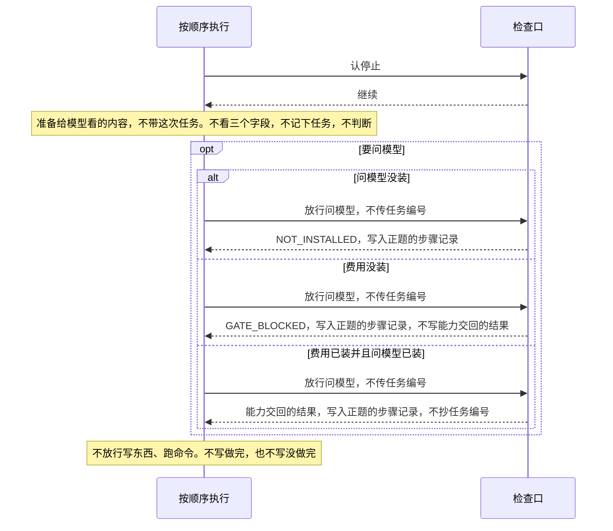
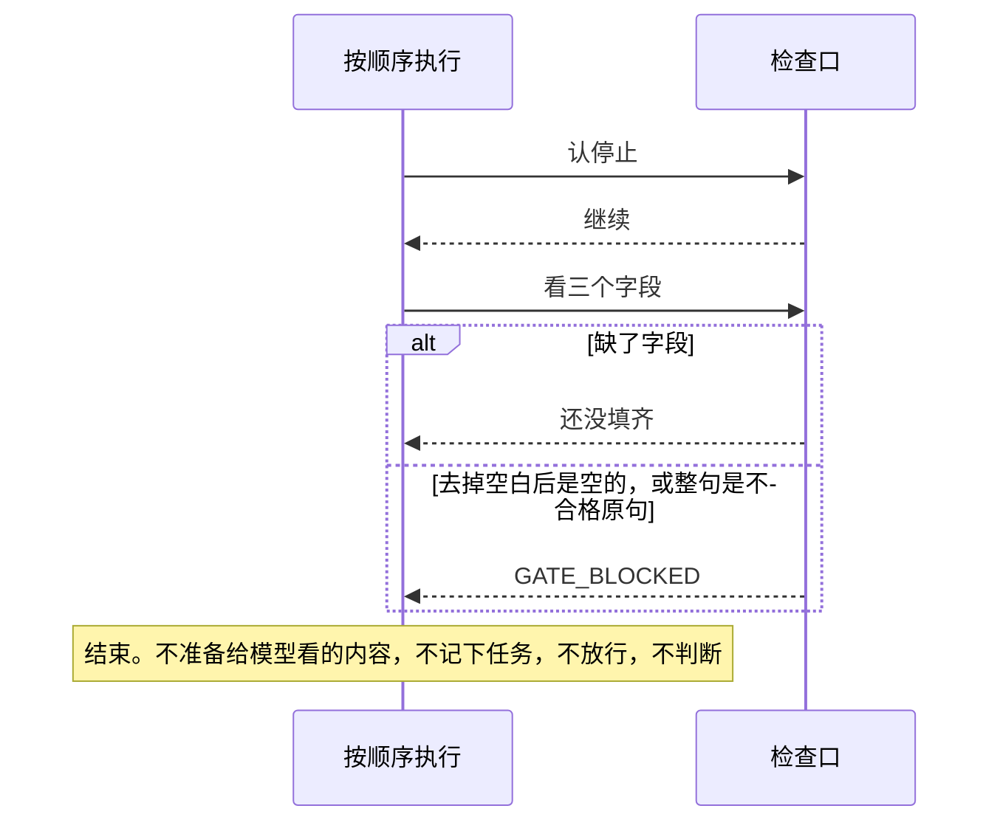
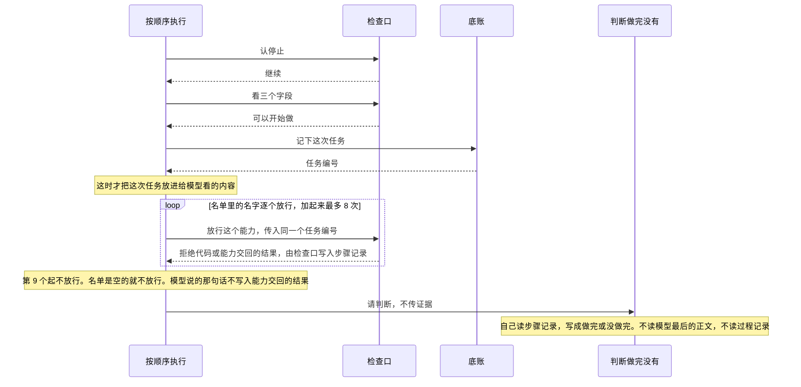
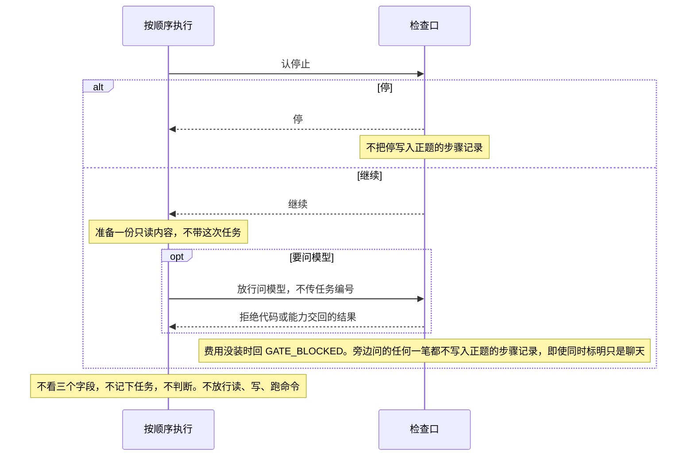

# 一轮里必须做到的事

总规则：[`../rewrite-1.md`](../rewrite-1.md) 第 2.5、2.6、3、4、6 节。

本文只写四个固定部分：底账、检查口、按顺序执行（含准备给模型看的内容）、判断做完没有。

费用够不够怎么算、等人同意等多久、读和写和跑命令具体怎么做、记忆怎么找回来，各有自己的说明，不在这里。

还没定下来的，不在这里编。停止词表、界面上用哪个词表示「只是聊天」，测试用下面的标记和例句，不自己加词。不合格的原句已经写在「词的意思」里。

## 本文管什么

**包括**

- 正题的顺序：认停止 → 是不是只聊天 → 还没填齐或填写不合格 → 记下这次任务 → 准备给模型看的内容 → 经检查口调用 → 判断做完没有。判断自己读步骤记录，不读过程记录。按顺序执行的部分不写步骤记录，走过的步骤写入过程记录。
- 三个字段只由人提交。任务编号由底账在开始做的时候分配。检查口只有在放行时收到了编号，才把它抄进能力交回的结果。
- 做完只认这种情况：能力交回的结果不是「问模型」的成功，上面抄的编号等于这次任务的编号，而且不是失败、拒绝、超时（第 7 条除外）。不看执行登记。问模型的成功不能单独算做完。
- 这一轮没有做判断时，步骤记录里既没有「做完」，也没有「没做完」。
- 旁边问一句：只准备一份只读内容，不写入正题的步骤记录，不新记一次任务，不调用读、写、跑命令，不判断做完没有。
- 步骤记录可以单独读回来。过程记录也可以单独读回来。

**不包括**

- 费用够不够的算法（见以后的《问模型》）
- 等人同意等多少秒（见以后的《等人同意》）
- 文件和程序具体怎么执行（见以后的《在允许范围内做事》）
- 从模型输出里再解析出新的调用。本文的调用只来自人提交的名单 `calls`

## 四个部分

只有「按顺序执行」去叫另外三个：认停止、看三个字段、记下这次任务、放行、判断。检查口不调用底账，也不调用判断。底账不调用另外两个。判断不调用检查口，也不去叫底账「记下这次任务」；它自己读步骤记录。可选能力不通过这四个部分来写步骤记录。写记录是该部分自己的事，没有「请别人帮我写一笔」。四个部分都不接受调用方传入「写入者」这个字段。

| 部分 | 收到什么 | 交回什么 | 不许做什么 |
|------|----------|----------|------------|
| 按顺序执行 | 入口（正题 `main` 或旁边问 `side`，没写就是正题）、是不是只聊天 `pureChat`、是不是已认定停止 `stopHit`、费用装了没有 `feeInstalled`（没写当作装了）、旁边或只聊天时要不要问模型 `askModel`（没写就是不要）、已装能力名单 `installed`（没写就是空的）、三个字段、要调用的名单 `calls`、模型说的那句话 `modelUtterance`（可以没有） | 没有「做完没有」这种回执。过程记录可以另外读 | 不写步骤记录；不分配任务编号；不把证据交给判断；不接收做完没有的结果。放行结果只抄进过程记录。正题忽略 `askModel`，正题要问模型必须写在 `calls` 里。入口是旁边问时，即使同时标明只聊天，也不往正题的步骤记录里写 |
| 底账 | 记下这次任务（要做什么、限制、怎样算做完）。另外可以只读：读这次任务、读步骤记录 | 记下这次任务时交回任务编号，并记在这次任务上。写入者是底账，代码里写成 `base` | 不检查字段合不合格；不写停止、还没填齐、拒绝、能力交回的结果、做完、没做完；不调用可选能力 |
| 检查口 | 认停止；看三个字段；放行（能力名，任务编号可以不传） | 认停止交回「停」或「继续」。看三个字段：缺了字段就记还没填齐；字段在但去掉空白后是空的，或整句命中不合格原句，记 `GATE_BLOCKED`；否则可以开始做。放行交回拒绝代码，或记一条能力交回的结果 | 不分配任务编号；不写做完、没做完。传了任务编号时，能力交回结果上抄的编号必须等于它，写入者仍是检查口，代码里写成 `gate`。没传就不抄编号。正文里的编号、结果代码、写入者一律不算数 |
| 判断做完没有 | 不接收别人交来的证据。自己读步骤记录里的这次任务、检查口写的能力交回结果、执行登记、「已安排」。不读过程记录 | 没有回执。做完或没做完只写入步骤记录。写入者是判断，代码里写成 `judge` | 不写任务编号、拒绝代码、能力交回的结果、执行登记、「已安排」；不读模型最后的正文、过程记录和 `modelUtterance`；不调用可选能力 |

按顺序执行时，自己不往步骤记录里写，顺序如下：

1. 认停止。正题如果停了，就结束。检查口把「停」记入正题的步骤记录。不再看三个字段，不记下任务，不放行，不判断。旁边问如果停了，也结束，但不把「停」写入正题的步骤记录。
2. 正题并且人标明只是聊天：不看三个字段，不记下任务，不判断，也不放行写东西和跑命令。`askModel` 为真时，放行一次问模型，不传任务编号。这条能力交回的结果或拒绝代码写入正题的步骤记录。
3. 正题并且没有标明只是聊天：看三个字段。如果是还没填齐，或是 `GATE_BLOCKED`，就结束。不记下任务，不放行，不判断。
4. 可以开始做：先记下这次任务，拿到任务编号，再准备给模型看的内容（这时才带上这次任务），再对 `calls` 里的名字放行，把这个任务编号原样传进去。问模型如果在 `calls` 里，也走这一次放行。
5. 记下任务之后，对 `calls` 放行，加起来最多 8 次，然后判断一次，不传证据。第 9 个起不放行、不写拒绝代码、不写能力交回的结果。满 8 次不是再判断一次。`modelUtterance` 不写入能力交回的结果。
6. 入口是旁边问：比「只是聊天」先处理。不看三个字段，不记下任务，不判断，也不放行读东西、写东西、跑命令。即使同时标明只是聊天，也不把任何一笔写入正题的步骤记录。`askModel` 为真时，放行一次问模型，不传任务编号。本文不为旁边问另开一本步骤记录。

放行时任务编号可以不传。检查顺序：名字没装上，先回 `NOT_INSTALLED`；名字装了，但这是问模型且费用没装，回 `GATE_BLOCKED`，不写能力交回的结果。传了任务编号才抄编号。

## 词的意思

费用以总规则第 2.3、2.4、7 节为准：没装费用就拦住问模型。旧稿「没装就不限额」作废。额度够不够仍不在本文。

| 词 | 意思 |
|----|------|
| 还没填齐 | 三个字段里有的没有提交。步骤记录里的原词是「待补全」。这不是填写不合格 |
| 去掉空白后是空的 | 字段提交了，去掉空白后一个字都没有。这是填写不合格，拒绝代码 `GATE_BLOCKED`。只去掉空白，不改大小写、标点、全角半角 |
| 不合格的原句 | 只有这三则，整句相同才算：去掉空白后是空的；要做什么等于 `按上面说的做`；怎样算做完等于 `完成` 或 `done`。`Done`、`完成。` 不算 |
| 能力交回的结果 | 只有检查口能写，写入者是 `gate`。步骤记录里的原词是「平台返回」。检查口根据能力交回的内容自己写，不从「按顺序执行」接收种类、结果代码或正文。能力交回的正文不能伪造编号、结果代码或写入者。结果种类只有成功、失败、拒绝、超时。问模型的成功可以记下，不能用来判做完 |
| 拒绝代码 | 只有这四个：`USER_DENIED`、`NOT_INSTALLED`、`APPROVAL_TIMEOUT`、`GATE_BLOCKED`。问模型先看装没装。没装是 `NOT_INSTALLED`。装了但费用没装，才是 `GATE_BLOCKED` |
| 执行登记 | 检查口写的一笔，写入者是 `gate`。程序里的原词是「句柄」。表示程序登记了一个要执行的位置。里面长什么样不在本文 |
| 已安排 | 只能由检查口写。这一轮已经有执行登记才允许写。没有执行登记，步骤记录里不得出现「已安排」。做完没有不看它。判断不读模型最后的正文 |
| 只聊天时的能力交回结果 | 写入正题的步骤记录，写入者是 `gate`，不抄任务编号。不写做完，也不写没做完 |
| 旁边问一句 | 比只聊天先处理。不写正题的步骤记录，也不另开一本旁边问的步骤记录。过程记录记下这次旁边问。同时标明只聊天时，仍不写正题的步骤记录。给模型看的内容是当时从原始记录再取的，只读，不能当证据 |
| 准备给模型看的内容 | 把固定说明和可见的几行放进模型能看见的序列。这不是安装新能力。不会失败。不写步骤记录，写入过程记录。过程记录里这一步的原词是「装载」。固定说明在记录里的原词是「总则」。这次任务在记录里的原词是「这一件」。人在步骤记录里看见的是调用、拒绝和判断 |
| 过程记录 | 只由「按顺序执行」来写。按顺序记下：认停、旁问、纯聊、未开跑、记下这一件、装载、放行、跳过、交判定。这八个原词就是记录里的步骤名。放行只记能力名，加上结果种类或拒绝代码，不另抄正文。判断不读。不能用来判做完 |
| 8 次 | 记下这次任务之后，问模型和工具放行加起来最多 8 次，然后判断一次。第 9 个起不放行，过程记录记「跳过」 |
| `stopHit` | 没写就是假。本文不去对词表。测试直接把这个标记设为真或假。整理原话的规则见总规则第 6.1 节 |
| `modelUtterance` | 只用来证明：这句话不能写入能力交回的结果，也不能当证据 |
| `askModel` | 没写就是假。为真时，还没停止的只聊天或旁边问，放行一次问模型。正题忽略它。正题的问模型必须在 `calls` 里 |

同一时刻只允许一条追加成功。用锁还是用队列，不在本文。同一次输入再提交一次、同一个任务编号再开跑，不在本文。「怎样算做完」整句等于某条结果代码时，失败的返回可以用来判做完。这条维持总规则，本文不改。

## 谁先调用谁

每张图都从认停止画起，画到这一支结束。准备给模型看的内容画在「按顺序执行」自己身上，不另立一部分。图里没出现的部分，就是这一支没有调用它。判断不把做完或没做完交回给按顺序执行的部分。

停止（只画正题；`stopHit` 为真）：

只是聊天（正题，人已标明，还没停）：

还没填齐，或填写不合格（正题，没有标明只聊天，还没停）：

开始做（正题，三个字段合格）：

旁边问一句（入口是 `side`）：

## 测试认这些输入

| 字段 | 意思 |
|------|------|
| `entry` | `main` 是正题，`side` 是旁边问一句。没写就是正题 |
| `pureChat` | 真，才是人标明的只聊天。没写或假，就是没有标明 |
| `stopHit` | 没写就是假。真，表示这一轮原话已经被停止词表认定。本文不去对词表 |
| `feeInstalled` | 没写就是真。假，表示没装费用 |
| `askModel` | 没写就是假。真的时候，还没停止的只聊天或旁边问，放行一次问模型。正题忽略它 |
| `installed` | 已经装上的能力名。没写就是空的。`calls` 里不在这张名单上的名字，视为没装。只聊天和旁边问，要看「问模型」在不在这张名单上 |
| `goal` `limit` `doneWhen` | 人提交的三个字段：要做什么、限制、怎样算做完。没有这个字段，是还没填齐。字段在但去掉空白后是空的，是填写不合格 |
| `calls` | 人提交的能力名名单。开始做之后只放行这些名字，最多 8 个。空名单就是不放行。正题要问模型，必须在这个名单里 |
| `modelUtterance` | 可以没有。只用来证明不能当证据 |

结果种类、结果代码、正文，不是「按顺序执行」的参数，也不是放行的参数。测试把它们放在能力交回给检查口的结果上。检查口自己写成步骤记录里的那一条。

| 测试放在能力交回上的 | 意思 |
|----------------------|------|
| 结果种类 | `成功`、`失败`、`拒绝`、`超时`。没写就是成功 |
| 结果代码 | 可以没有。失败的例子只用 `FAILED`。正文里写出同一个字，不算 |
| 正文 | 可以没有。不能当成抄上去的任务编号，也不能当成结果代码 |

程序不能调用模型来判断：这是不是只聊天、要不要停、三个字段该填什么。

## 谁写步骤记录

每条步骤记录都带写入者。按顺序执行的部分不能写步骤记录，只写过程记录。同一时刻只有一个写入者可以追加。

| 内容 | 写入者 |
|------|--------|
| 还没填齐、填写不合格造成的拒绝、停止、拒绝代码、能力交回的结果、执行登记、已安排 | `gate`（检查口） |
| 这次任务的编号 | `base`（底账） |
| 做完 / 没做完 | `judge`（判断）。只有做了判断才有这两笔 |

没做判断时，不写做完，也不写没做完。传了任务编号时，能力交回结果上的编号由检查口抄，而且必须等于传入的值。不能把这笔的写入者记成底账。没传就不抄编号。正文里的编号不算抄写。做完没有不看执行登记。

可选能力不能把做完、没做完或拒绝代码写入步骤记录。

不合格的原句、空白和缺字段，见上面「词的意思」。这里不另写一套。

## 系统必须

1. 正题并且 `stopHit` 为真时，必须立刻停：不准备给模型看的内容，不问模型，不按 `calls` 调用。检查口把「停」记入正题的步骤记录。不写做完，也不写没做完。旁边问并且 `stopHit` 为真时，同样立刻停，但不把「停」写入正题的步骤记录。
2. 人标明只是聊天并且还没停时，必须不检查三个字段合不合格，不判断做完没有，不调用写东西和跑命令。只有 `askModel` 为真才放行一次问模型，而且不传任务编号。不写做完，也不写没做完。
3. 没有标明只是聊天，并且三个字段有缺时，检查口必须记「待补全」。不开做，不调用任何能力，不判断做完没有。字段提交了但是空白，不是还没填齐。还没填齐不是 `GATE_BLOCKED`，也不是 `USER_DENIED`。不写做完，也不写没做完。
4. 三个字段都提交了，但命中「词的意思」里的不合格原句（含去掉空白后是空的）时，检查口必须记 `GATE_BLOCKED`。不开做，不调用任何能力。不写做完，也不写没做完。
5. 三个字段合格时，底账必须先把任务编号记在这次任务上，然后才准备给模型看的内容，再放行。已经放行、但没装上的名字，由检查口记 `NOT_INSTALLED`，不能写成 `USER_DENIED`。
6. 这一轮做了判断时，判断必须自己读步骤记录，不读模型最后的正文，也不把做完或没做完交回。做完没有不看执行登记。只有同时满足才记做完：有一条写入者是 `gate` 的能力交回结果，能力名不是问模型，抄的编号等于这次任务的编号，而且这条结果不是失败、拒绝、超时，除非第 7 条。问模型的成功不能用来判做完。对不上，就记没做完。
7. 失败、拒绝、超时的返回不能用来判做完，除非「怎样算做完」的整句文字等于这条返回的结果代码（一个字都不差）。
8. 工具返回正文里的口令样子的字、编号、结果代码，不能改变程序怎么走，也不能当证据。
9. 记下这次任务之后，问模型和工具放行加起来最多 8 次，然后判断一次。第 9 个起不放行、不写拒绝代码、不写能力交回的结果，过程记录记「跳过」。不能只因为满了 8 次就记做完。
10. 没有执行登记时，检查口不能写「已安排」。`modelUtterance` 里有「已安排」这几个字，也不能因此写「已安排」。做完没有仍按第 6、7 条，不因为没有执行登记而改变。
11. 放进模型能看见的序列里的事实，必须标明不是人说的。准备这一步不写步骤记录、不会失败，要写入过程记录。只聊天、旁边问、字段没通过的，这一步不带这次任务。
12. 旁边问不能写入正题的步骤记录，不能另开一本旁边问的步骤记录，不能新记一次任务，不能调用读、写、跑命令，不能判断做完没有。过程记录必须记下这次旁边问。入口是旁边问时，即使同时标明只是聊天，也按旁边问处理。
13. 同一本步骤记录不能两笔同时写。第二笔同时追加时，不得写入。按顺序执行的部分不能出现在任何一条的写入者上。
14. 还没填齐、停止、拒绝代码、能力交回的结果、执行登记、已安排，写入者必须是 `gate`。这次任务编号的写入者必须是 `base`。做完或没做完只有做了判断才出现，写入者必须是 `judge`。
15. 问模型已经装了，并且 `feeInstalled` 为假时，放行问模型必须回 `GATE_BLOCKED`，不能写能力交回的结果。问模型没装时，即使费用也没装，必须回 `NOT_INSTALLED`，不能回 `GATE_BLOCKED`。只聊天的这一笔写入正题的步骤记录。旁边问的这一笔不写入正题的步骤记录。
16. 只聊天、`askModel` 为真、费用已装、问模型已装、能力交回成功时，能力交回的结果写入正题的步骤记录，写入者是 `gate`，不抄任务编号。
17. 按顺序执行必须把走过的步骤按顺序写入过程记录，用来监控。过程记录只由它来写。判断不能读过程记录。过程记录不能用来判做完。放行在过程记录里只记能力名，加上结果种类或拒绝代码。

## 验收

编号 V 的条目从步骤记录读回来，不看函数返回了什么。过程从过程记录读回来。给模型看的说明全文不在步骤记录上。没出现的记录，就是没有那一笔。

| 编号 | 输入 | 必须见到 |
|------|------|----------|
| V-01 | 正题，`stopHit` 为真 | 步骤记录有「停」，写入者是 `gate`。没有问模型。没有做完，也没有没做完 |
| V-02 | 标明只聊天，没有三个字段 | 没有「待补全」，没有 `GATE_BLOCKED`，没有做完，没有没做完，没有写东西，没有跑命令 |
| V-03 | 没有标明只聊天，没有提交「怎样算做完」 | 有「待补全」，写入者是 `gate`。没有调用能力。没有做完，没有没做完。这不是 `GATE_BLOCKED` |
| V-04 | 要做什么等于 `按上面说的做`，另外两个字段是普通非空句，也不在不合格原句里 | `GATE_BLOCKED`，写入者是 `gate`。没有调用能力。没有做完，没有没做完 |
| V-05 | 三个字段是普通非空句，`calls` 里有一个不在已装名单上的名字 | `NOT_INSTALLED`，写入者是 `gate`。这次任务的编号写入者是 `base`。没做完，写入者是 `judge` |
| V-06 | 三个字段合格，`calls` 是空的，模型说「已完成」 | 没有能力交回的结果。没做完，写入者是 `judge`。没有做完 |
| V-07 | 三个字段合格，`calls` 一个名字，不是问模型，而且已经装上；能力交回成功 | 能力交回的结果写入者是 `gate`，抄的编号等于这次任务的编号。做完，写入者是 `judge`。过程记录里能看见装了固定说明和这次任务，并且标明不是人说的。步骤记录里没有「装载」 |
| V-08 | 同 V-07，并且能力交回的正文里还有另一个编号 | 抄的编号仍等于这次任务的编号。做完，写入者是 `judge` |
| V-09 | 同 V-07，但能力交回失败，结果代码是 `FAILED`，「怎样算做完」不是 `FAILED` | 没做完，写入者是 `judge` |
| V-10 | 三个字段合格，`calls` 有 8 个都不在已装名单上的名字 | 8 条 `NOT_INSTALLED`。没做完，写入者是 `judge` |
| V-11 | 三个字段合格，`calls` 是空的，没有执行登记，模型说「已安排」 | 没有「已安排」。没做完，写入者是 `judge`。原因是没有对得上的能力交回结果，不是因为没有执行登记 |
| V-12 | 旁边问一句 | 正题的步骤记录没有新的这次任务，没有读、写、跑命令，没有做完，没有没做完 |
| V-13 | 任何会写步骤记录的情况 | 停止、还没填齐、拒绝、能力交回的结果、执行登记、已安排，写入者是 `gate`。这次任务编号的写入者是 `base`。做完或没做完只在做了判断时出现，写入者是 `judge` |
| V-14 | 标明只聊天，要问模型，费用没装，问模型已装 | `GATE_BLOCKED`，写入者是 `gate`。没有能力交回的结果。没有做完，没有没做完 |
| V-15 | 旁边问，并且 `stopHit` 为真 | 正题的步骤记录没有「停」，没有这次任务，没有做完，没有没做完 |
| V-16 | 要做什么是三个空格，另外两个字段是普通非空句 | `GATE_BLOCKED`。没有「待补全」。没有调用能力。没有做完，没有没做完 |
| V-17 | 怎样算做完等于 `完成`，另外两个字段是普通非空句 | `GATE_BLOCKED`。没有调用能力。没有做完，没有没做完 |
| V-18 | 三个字段合格，`calls` 只有问模型，问模型已装，费用没装 | `GATE_BLOCKED`。没有 `NOT_INSTALLED`。没有能力交回的结果。没做完，写入者是 `judge` |
| V-19 | 三个字段合格，`calls` 只有问模型，已装名单是空的，费用没装 | `NOT_INSTALLED`。没有 `GATE_BLOCKED`。没做完，写入者是 `judge` |
| V-20 | 三个字段合格，`calls` 有 9 个都不在已装名单上的名字 | 前 8 个各有 `NOT_INSTALLED`。第 9 个没有拒绝代码，也没有能力交回的结果。没做完，写入者是 `judge` |
| V-21 | 旁边问，要问模型，费用没装，问模型已装 | 正题的步骤记录没有拒绝代码，没有能力交回的结果，没有这次任务。过程记录有「旁问」，并且放行记着 `GATE_BLOCKED` |
| V-22 | 标明只聊天，要问模型，费用已装，问模型已装，能力交回成功 | 能力交回的结果写入者是 `gate`，没有抄任务编号。没有做完，没有没做完 |
| V-23 | 三个字段合格，`calls` 只有问模型，问模型已装，费用已装，能力交回成功 | 有能力交回的结果，并且抄了编号。没有做完。没做完，写入者是 `judge` |
| V-24 | 旁边问，同时标明只聊天，要问模型，费用已装，问模型已装 | 正题的步骤记录没有能力交回的结果，没有这次任务，没有做完 |
| V-25 | 三个字段合格，`calls` 一个已装的、不是问模型的名字，能力交回成功 | 过程记录按顺序是：认停并且继续、记下这一件、装载（固定说明和这次任务都标明不是人说的）、放行并且结果是成功、交判定。步骤记录里没有「装载」。做完仍在步骤记录里 |
| V-26 | 三个字段合格，`calls` 有 9 个都不在已装名单上的名字 | 过程记录有 8 次放行。第 9 个是跳过。步骤记录里没有第 9 个 |
| V-27 | 同 V-21 | 过程记录有旁问，并且放行记着 `GATE_BLOCKED`。正题的步骤记录没有这条拒绝代码，也没有做完 |

## 还没定，测试不能自己补

- 停止词表里有哪些句子（测试直接设置 `stopHit`；整理原话的规则见总规则第 6.1 节）
- 人在界面上用哪个词表示只是聊天（测试直接设置 `pureChat`）
- 上面三句以外，还有哪些空话算不合格
- 固定说明的全文
- 执行登记里面长什么样
- 压缩如果入账，谁来写
- 同时追加时用锁还是用队列
- 同一次输入再提交、同一个任务编号再开跑
- 结果代码的全表。测试里的失败只用 `FAILED`
- 等同意的时限、费用怎么算、允许范围怎么写
