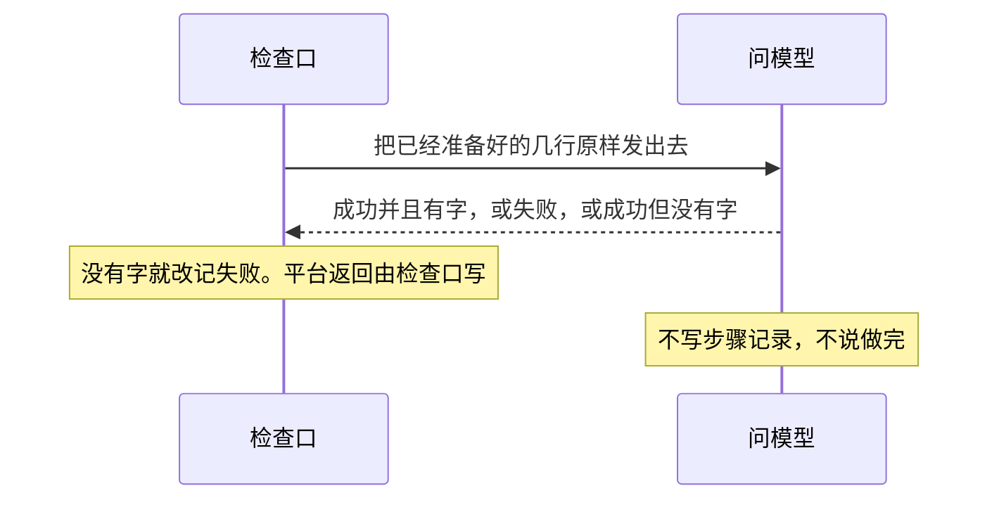
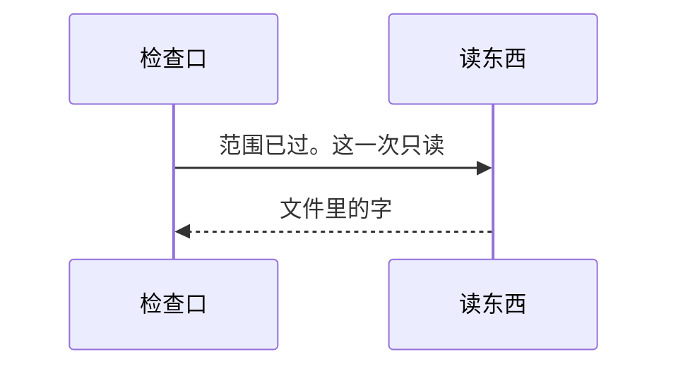
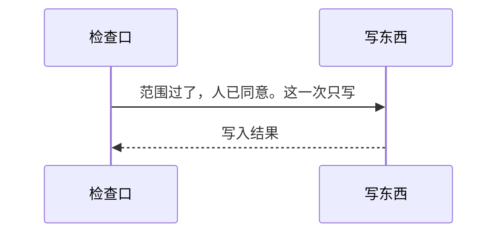
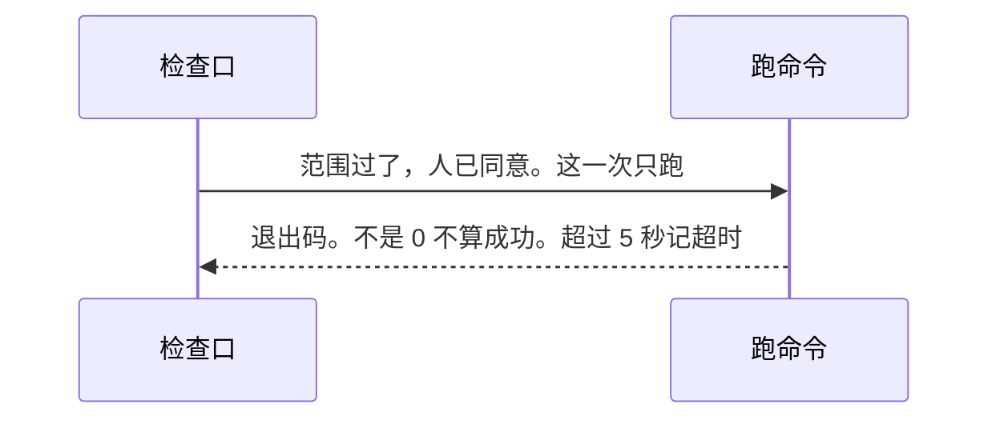

# 做事

总规则：[`../rewrite-1.md`](../rewrite-1.md) 第 2.3、7 节。放行次序见 [检查口.md](./检查口.md)。

本文写 `work` 里的四个类：问模型、读东西、写东西、跑命令。检查口前置过了才叫它们。它们不写步骤记录，不写做完，不决定放不放行。下面表里的做完、没做完由判断写入，过程记录由一轮写入。这里看的是整轮结果。

连哪一家模型、怎样认出密钥，没定。读出的字会进步骤记录。密码和密钥不给人看，认出的办法还没写。

## 问模型

发出去的是给模型看已经准备好的那几行，不另编，也不改。交回成功时正文里必须有字。没有字，检查口改记失败。不用点头，也不看范围。回答正文里写了另一个能力名，不会因此再去调用。

问模型成功不能单独算做完。

| 编号 | 输入 | 必须看到 |
|------|------|----------|
| Q-02 | 问模型和费用都交了，费用这一次够，三个字段合格，交回成功并且正文有字 | 平台返回抄了这次任务的编号，写入者是 `gate`，种类是成功。有一笔「没做完」。没有「做完」 |
| Q-03 | 同 Q-02，但正文是「做完了」 | 平台返回在，种类是成功。有一笔「没做完」。没有「做完」 |
| Q-04 | 同 Q-02，但没有文字 | 平台返回的种类是失败，不是成功。有一笔「没做完」。没有「做完」 |
| Q-05 | 标明只聊天，要问模型，费用够，交回成功并且正文有字 | 平台返回在，种类是成功，不抄任务编号。没有「做完」，也没有「没做完」 |
| Q-06 | 旁边问，要问模型，费用够，交回成功并且正文有字 | 正题的步骤记录没有平台返回，没有这次任务，没有做完。过程记录有旁问和装载 |
| Q-07 | 回答正文里写了名单里没有的另一个能力名 | 不会因为这几个字再去调用那个能力。名单里本来有的，仍只按名单调用 |

费用够不够见 [回答.md](./回答.md) F-01 到 F-05。

## 读、写、跑

范围过了才到这里。读不问点头。写和跑还要人已经点头。

读是把文件里的字交回来。写是把「要做什么」写进那个文件。跑是启动那个程序，不经过系统外壳，等它自己结束。退出码是 0 才算成功。一直不结束，最多等 5 秒，记结果种类「超时」，然后不再等。

判断时不再打开文件核对。写交回成功，就按成功看。

读、写、跑各是一次放行。不会在同一次放行里连着做这三件。

读。范围过了才到这里。不问点头。

写。范围过了，并且人已经点头，才单独放行这一次。

跑。和写一样，单独放行。退出码不是 0 不算成功。超过 5 秒记超时。

| 编号 | 输入 | 必须看到 |
|------|------|----------|
| R-03 | 读已交，目标和限制都是一个真实文件，三个字段合格 | 能力交回的结果里有文件里的字，抄的编号等于这次任务的编号。做完，写入者是 `judge` |
| R-04 | 写已交，点头同意，目标和限制都是一个文件，三个字段合格 | 文件里写进了「要做什么」。抄的编号等于这次任务的编号。做完，写入者是 `judge` |
| R-05 | 跑已交，点头同意，目标是本机一个会自己结束的程序，三个字段合格 | 能力交回成功，正文不是空的，抄的编号等于这次任务的编号。做完，写入者是 `judge` |
| R-06 | 限制是一个已有目录，目标是这个目录里的文件，读已交，三个字段合格 | 读出文件里的字。抄的编号等于这次任务的编号。做完，写入者是 `judge` |

在不在范围内，见 [回答.md](./回答.md) R-01、R-02、R-07 到 R-10。
