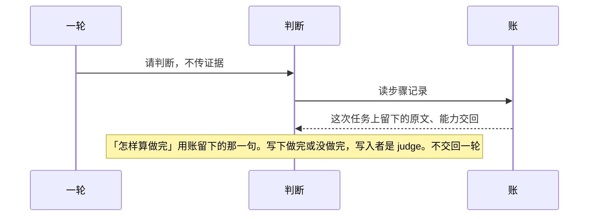

# 判断

总规则：[`../rewrite-1.md`](../rewrite-1.md) 第 3.1、3.2 节。一轮什么时候来叫，见 [一轮.md](./一轮.md)。

本文只写 `judge`。它自己读步骤记录，写下做完或没做完。它不读过程记录，不读模型最后的正文，不把结果交回一轮。

## 本文管什么

**包括**

- 做完只认这一条：写入者是 `gate` 的能力交回，能力名不是问模型，抄的编号等于这次任务的编号，而且不是失败、拒绝、超时。
- 问模型成功不能单独算做完。
- 失败、拒绝、超时不能算做完，除非「怎样算做完」整句等于这条结果代码，一个字都不差。
- 对不上，记没做完。
- 没被一轮叫到时，步骤记录里既没有做完，也没有没做完。
- 不看执行登记。正文里的编号、口令样子的字，不算证据。

**不包括**

- 模型说「已完成」
- 记忆、转述

## 时序

已经停下、只聊天、旁边问、字段没过，一轮不来叫。这张图不出现。

## 验收

| 编号 | 输入 | 必须看到 |
|------|------|----------|
| J-01 | 三个字段合格，「怎样算做完」整句等于 `FAILED`，能力交回失败，结果代码也是 `FAILED`，能力名不是问模型，编号对得上 | 做完，写入者是 `judge`。没有没做完 |

V-06、V-07、V-09、V-23、Q-02 的做完没做完也按本文规则。输入以 [一轮.md](./一轮.md) 和 [做事.md](./做事.md) 为准，本文不另写一遍。
