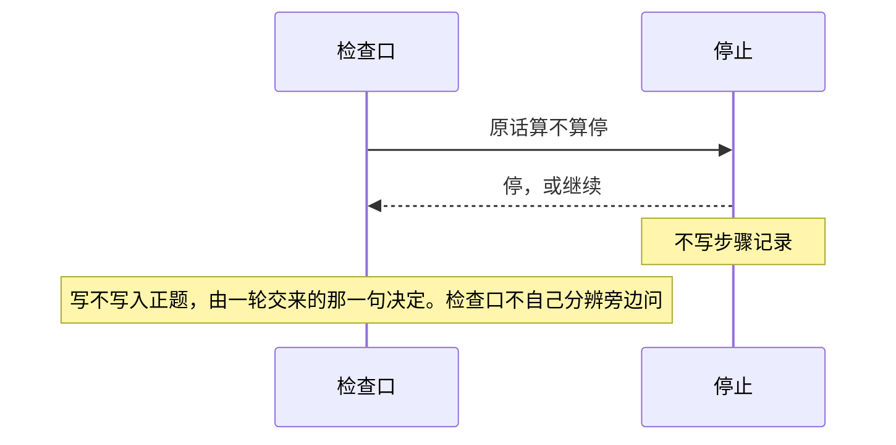
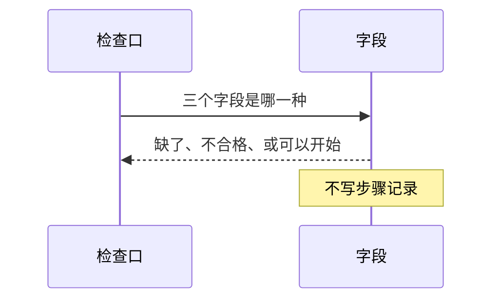
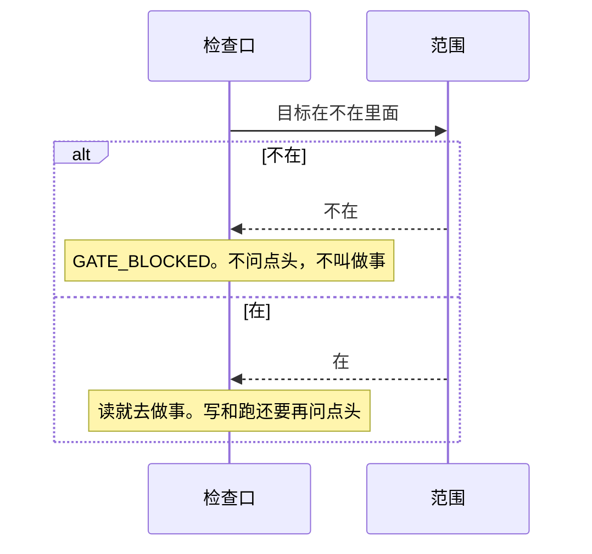
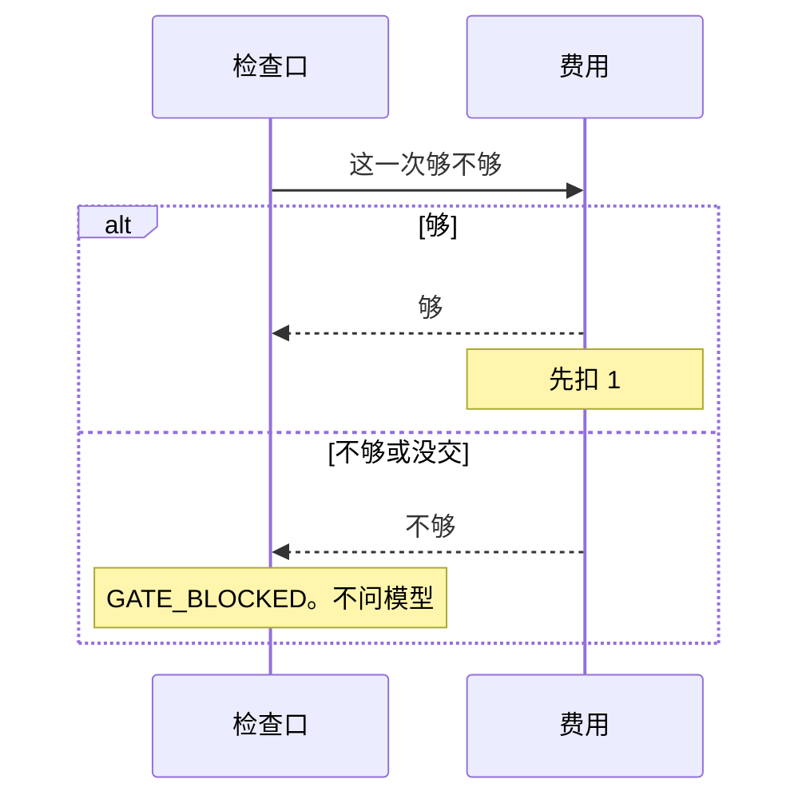
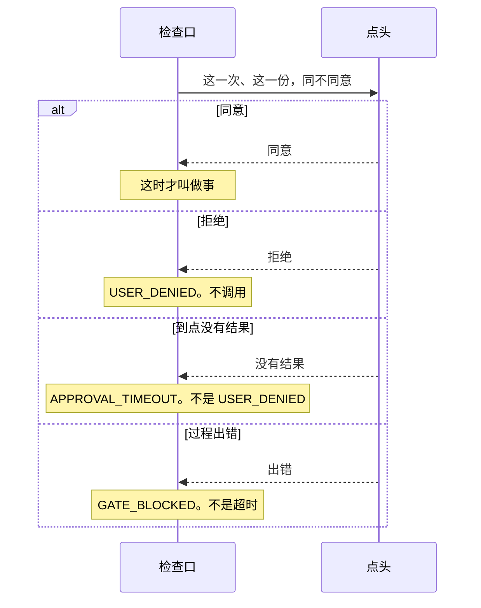

# 回答

总规则：[`../rewrite-1.md`](../rewrite-1.md) 第 5、6、7 节。检查口按什么次序来问，见 [检查口.md](./检查口.md)。

本文写 `answer` 里的五个类：停止、字段、范围、费用、点头。它们只回答一个问题。除费用扣自己的次数外，它们不写步骤记录。它们不知道一轮怎么排。

## 停止

看人的整段原话。整理时只去掉空白和标点，英文改成小写。全角英文不改成半角。不猜意思。模型说停了不算。

没交词表时，默认两句：`停`、`stop`。交了就整份换掉，不往默认上加。空表只靠停止标记。停止标记为真，原话对不上也停。

| 编号 | 输入 | 必须看到 |
|------|------|----------|
| S-01 | 词表有「停」，人的原话是「停」，停止标记是假 | 正题有「停」。没有做完，没有没做完，没有继续调用 |
| S-02 | 词表有「停」，原话是「停，然后继续」 | 没有「停」。不记停，后面的检查照旧走 |
| S-03 | 词表有 `stop`，原话是 `  STOP!!! ` | 正题有「停」 |
| S-04 | 词表有「停」，人的原话是空的，模型那句话是「停」 | 没有「停」 |
| S-05 | 旁边问，原话对上词表 | 正题的步骤记录没有「停」，也没有去问模型。过程记录的步骤名是认停，附注是「旁问停」 |
| S-06 | 词表有 `stop`，原话是全角的「ＳＴＯＰ」 | 没有「停」。不记停，后面的检查照旧走 |
| S-07 | 没交词表，原话是「停止」 | 没有「停」。不记停，后面的检查照旧走 |
| S-08 | 只交了「取消」，原话是「停」 | 没有「停」。词表被整份换掉，默认的「停」不再算 |
| S-09 | 没交词表，原话是 `stop` | 正题有「停」。没有做完，没有没做完，没有继续调用 |
| S-10 | 空表，原话是「停」，停止标记是假 | 没有「停」。不记停，后面的检查照旧走 |
| S-11 | 空表，停止标记是真，原话对不上 | 正题有「停」。没有做完，没有没做完，没有继续调用 |
| S-12 | 词表只有「停止」，原话是「停止」 | 正题有「停」 |
| S-13 | 词表只有「取消」，原话是「取消」 | 正题有「停」。换上的词仍然算 |
| S-14 | 没交词表，原话整理后一个字都没有，例如「！！！」 | 没有「停」。不记停，后面的检查照旧走 |

超时、管理员停止，不在本文。

## 字段

三个字段只由人提交。字段不从原话里抽。

没提交，是还没填齐，原词「待补全」。提交了、去掉空白后是空的，是不合格，`GATE_BLOCKED`。不合格原句只有这三则，整句相同才算：去掉空白后是空的；要做什么等于 `按上面说的做`；怎样算做完等于 `完成` 或 `done`。`Done`、`完成。` 不算。不忽略大小写，不忽略标点，不把全角半角当成一样。

还没填齐、不合格的记录见 [一轮.md](./一轮.md) V-03、V-04、V-16、V-17。

## 范围

两种算在里面。目标与「限制」整句相同。或者「限制」是一个已经存在的目录，目标落在这个目录里面。用 `..` 逃到外面，不算。目录里的快捷方式按它真正指到的位置算。限制自己是快捷方式时，仍按写下来的位置算。不做通配。整句比较不忽略大小写，不忽略标点。

没带目标，或不在里面，检查口记 `GATE_BLOCKED`，不调用，也不问点头。名字没交进来，仍先是 `NOT_INSTALLED`。问模型不看范围。

| 编号 | 输入 | 必须看到 |
|------|------|----------|
| R-01 | 写东西已交，点头已交，但没有目标 | `GATE_BLOCKED`。没有去调用，也没有去问点头 |
| R-02 | 读东西没交，目标却和限制相同 | `NOT_INSTALLED`。没有 `GATE_BLOCKED` |
| R-07 | 限制是一个已有目录，目标在目录外面，写和点头都交了 | `GATE_BLOCKED`。没有去调用，也没有去问点头 |
| R-08 | 限制是一个已有目录，目标用上级目录逃到外面 | `GATE_BLOCKED`。没有去调用 |
| R-09 | 限制是一个已有目录，目标是这个目录里的快捷方式，快捷方式指到目录外面的文件 | `GATE_BLOCKED`。没有去调用。外面文件里的字不进步骤记录 |
| R-10 | 限制自己是一个快捷方式，目标落在它真正指到的外面 | `GATE_BLOCKED`。不因为限制是快捷方式就把外面放进来 |

读出、写入、跑起来之后的结果，见 [做事.md](./做事.md)。

## 费用

问一次算 1。交进来时给出还能问几次。够了先扣 1，再去问。到 0 就不够，不会扣成负数。不能装成永远够。次数不进步骤记录。上一次够，不留给下一次。

问模型没交进来时，检查口记 `NOT_INSTALLED`，不问费用。

| 编号 | 输入 | 必须看到 |
|------|------|----------|
| F-01 | 问模型已交，费用没交 | `GATE_BLOCKED`。没有能力交回的结果。没有去调用 |
| F-02 | 两个都交了，这一次回答不够 | `GATE_BLOCKED`。没有能力交回的结果。没做完。没有去调用。过程记录的放行是「问模型 GATE_BLOCKED」 |
| F-03 | 两个都交了，第一次够并交回成功且正文有字，第二次不够 | 成功结果只有一笔。第二次是 `GATE_BLOCKED`。问了两次够不够，只调用了一次 |
| F-04 | 问模型没交，费用交了 | `NOT_INSTALLED`。没有 `GATE_BLOCKED`。没有去问够不够 |
| F-05 | 旁边问，要问模型，费用交了但不够，问模型已交 | 正题的步骤记录没有拒绝代码，没有能力交回的结果。过程记录有旁问，并且放行记着 `GATE_BLOCKED`。没有去调用 |

## 点头

需要点头的只有写东西、跑命令。读和问模型不问。

默认等 60 秒，不能改成 0。到点没有结果，记 `APPROVAL_TIMEOUT`，不能记成 `USER_DENIED`。点头过程出错，记 `GATE_BLOCKED`，不算超时。人拒绝记 `USER_DENIED`。

只对这一次、这一份内容有效。这一份是：能力名，加上要做什么、限制、怎样算做完、这次要碰到的地方。碰到的地方不同，就不是同一份。同意不留给下一次。没交点头时，写和跑记 `GATE_BLOCKED`，不调用。

| 编号 | 输入 | 必须看到 |
|------|------|----------|
| A-01 | 写东西已交，点头没交，三个字段合格，目标在允许范围内 | `GATE_BLOCKED`。没有能力交回的结果。没做完。没有去调用。拦住的原因是没装点头，不是超出范围 |
| A-02 | 跑命令已交，点头没交，其余同 A-01 | 同 A-01，对象是跑命令 |
| A-03 | 写东西没交，点头交了 | `NOT_INSTALLED`。没有 `USER_DENIED`，没有 `GATE_BLOCKED` |
| A-04 | 两个都交了，这一次的结果是拒绝 | `USER_DENIED`。没有 `APPROVAL_TIMEOUT`，没有能力交回的结果。过程记录的放行是「写东西 USER_DENIED」 |
| A-05 | 两个都交了，这一次没有结果 | `APPROVAL_TIMEOUT`。没有 `USER_DENIED`，没有能力交回的结果 |
| A-06 | 两个都交了，这一次是同意，能力交回成功 | 能力交回的结果抄了这次任务的编号。做完 |
| A-07 | 只交了读东西，没有点头，读成功 | 做完。没有去问点头 |
| A-08 | 两个都交了。第一次同内容同意并写成功。第二次还是这份内容，结果改成拒绝 | 第二次是 `USER_DENIED`。写东西的成功结果只有一笔 |
| A-09 | 两个都交了。第一份内容是拒绝。换了要做什么，第二次是同意并写成功 | 点头被问了两次。第二份有能力交回的结果 |
| A-10 | 写东西已交，点头已交，三个字段合格，目标在范围内，问点头时过程出错 | `GATE_BLOCKED`。没有 `APPROVAL_TIMEOUT`。没有去调用 |

界面上哪个按钮，不在这里。
