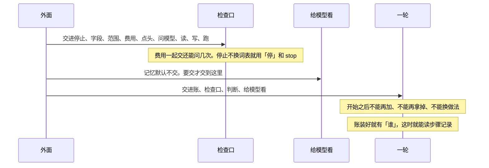
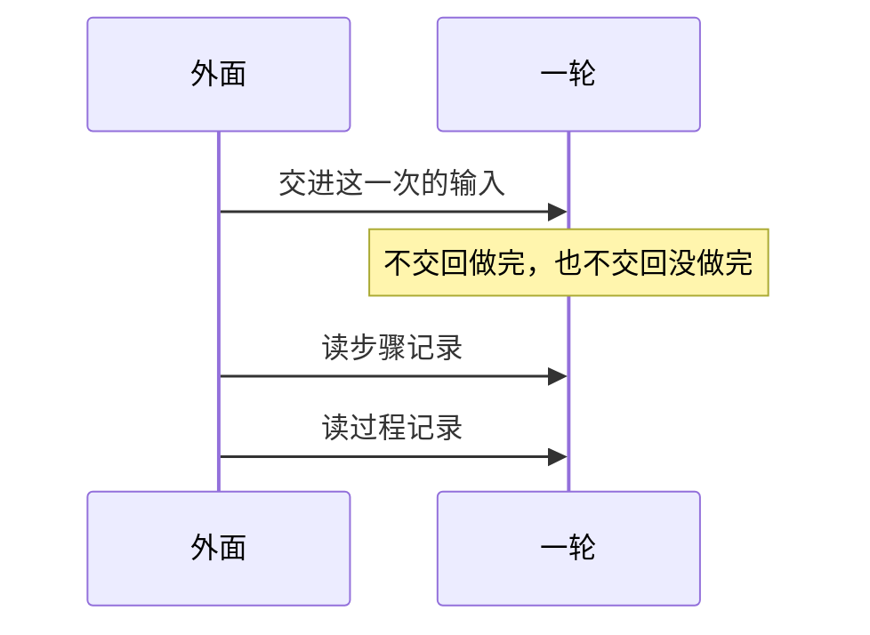

# 对外

总规则：[`../rewrite-1.md`](../rewrite-1.md) 第 2.2、4 节。启动时交哪些、没交会怎样，见 [`../agent-os.md`](../agent-os.md) 第 7 节。跑起来以后怎么走，见 [一轮.md](./一轮.md)。

本文只写外面那一道门。里面七个包谁问谁，不在这里。

## 本文管什么

**包括**

- 启动前交一次。账、检查口、判断、给模型看由一轮去问。停止、字段、范围、费用、点头、问模型、读、写、跑交给检查口。费用要一起交还能问几次。停止不另交词表，就用「停」和 `stop`；交了就整份换掉。记忆默认不交，要交才交给给模型看。这一次运行开始之后不能再加、不能再拿掉、不能换做法。
- 每次跑一轮，交进这一次的输入。跑完，这一次调用本身没有做完，也没有没做完。
- 结果只读两本记录。步骤记录里看「谁」、任务编号、待补全、停、拒绝、能力交回、做完没做完。账装好就能看见「谁」，不必等跑完一轮。过程记录里看这一轮走过的步骤。过程记录不能拿来判做完。

**不包括**

- 包和包怎么问
- 网上怎么传。总规则已另文再定
- 怎样算做完，见 [判断.md](./判断.md)
- 排队、关机后还在不在、多人同时用

## 时序

启动，只此一次：

跑一轮：

## 这一次的输入

没写就是下面的缺省。

| 字段 | 缺省 | 是什么 |
|------|------|--------|
| `entry` | 正题 | 没写就是正题。旁边问另标 |
| `pureChat` | 假 | 只有人标明，才是只聊天 |
| `stopHit` | 假 | 停止标记。为真时，原话对不上也停 |
| `said` | 空 | 人的整段原话。停只看这句，不看模型那句话 |
| `askModel` | 假 | 只用于还没停的只聊天和旁边问。正题不看它 |
| `goal` | 没提交 | 要做什么 |
| `limit` | 没提交 | 限制 |
| `doneWhen` | 没提交 | 怎样算做完 |
| `calls` | 空 | 每一项有能力名。读、写、跑还带目标。没写目标就是空 |
| `modelUtterance` | 空 | 模型那句话。不写入能力交回 |

结果种类只有成功、失败、拒绝、超时。失败的例子用 `FAILED`。各条路必须见到什么，见 [一轮.md](./一轮.md)。

## 验收

| 编号 | 输入 | 必须看到 |
|------|------|----------|
| D-01 | 任意一次跑完 | 这一次调用本身没有做完，也没有没做完。做完或没做完只出现在步骤记录里，而且只有做了判断才有 |
| D-02 | 任意一次跑完 | 走过的步骤只在过程记录里。拿过程记录不能把一件事判成做完 |
| D-03 | 这一次运行已经开始 | 没有再交能力的入口。已经交过的不能拿掉，也不能换做法 |
