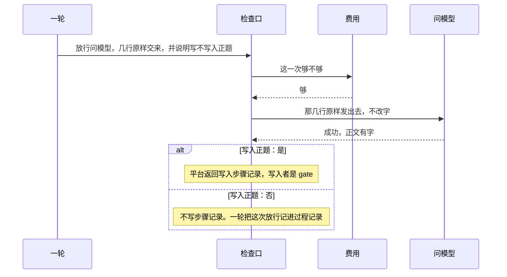
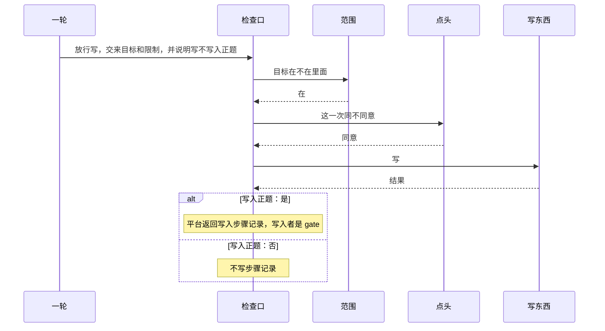
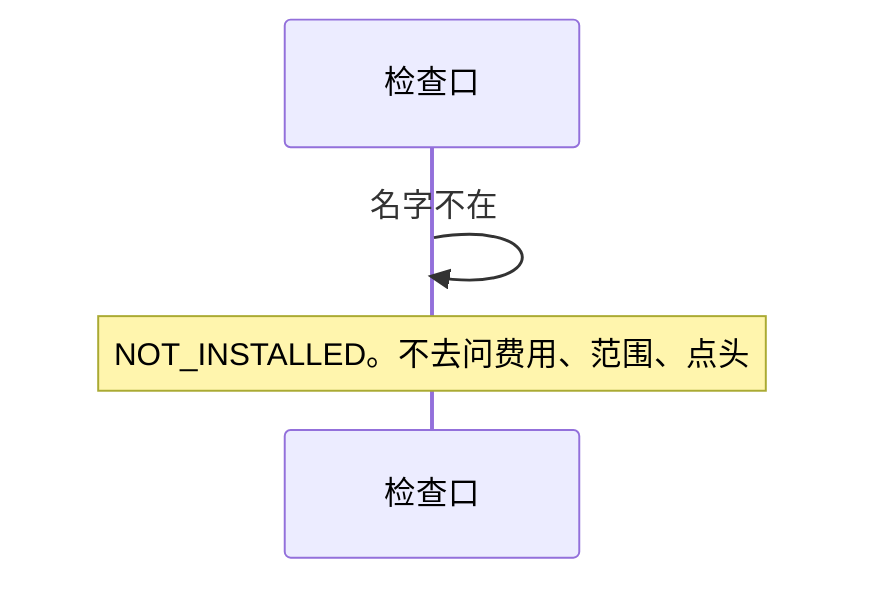

# 检查口

总规则：[`../rewrite-1.md`](../rewrite-1.md) 第 2.4、2.5、6.2 节。

本文只写 `gate`。它按被问到的名字去问回答或做事，再把允许落笔的结果写上。它自己不判断停不停、字段合不合格、在不在范围内、同不同意、够不够。它不写做完。它不知道正题、只聊天、旁边问、8 次。一轮交来「这次写不写入正题的步骤记录」，它照做。它自己不等待。点头等 60 秒，那是点头的事。

四种拒绝只有这四个字：`USER_DENIED`、`NOT_INSTALLED`、`APPROVAL_TIMEOUT`、`GATE_BLOCKED`。写这些的人是 `gate`。

## 放行次序

1. 这个名字启动时没交进来：记 `NOT_INSTALLED`，结束。不去问它的前置。
2. 交进来了：按那份说明的前置从左到右问回答里的类。某一前置没交进来，或回答了不许，记下那份说明要求的拒绝，不调用做事。
3. 前置都过了，才调用做事里的那个类。问模型交回成功但没有字，改记失败。

读、写、跑先问范围。写和跑再问点头。问模型问费用，不问范围，也不问点头。范围没过，不去问点头。

一轮把给模型看已经准备好的几行原样交来。检查口不改这几行，原样交给问模型。

传了任务编号，才把它抄进能力交回的结果。没传就不抄。写入者仍是 `gate`，不是 `base`。

没有执行登记，不能写「已安排」。

## 时序

问模型，费用够：

写东西，范围在、人点头：

超出范围：问到范围说不在就结束。不问点头，不写、不跑。

名字没交进来：

## 验收

次序用这些已经定死的行来对，不另编一套：

| 看见 | 说明 |
|------|------|
| [回答.md](./回答.md) F-04 | 问模型没交，费用交了，仍是 `NOT_INSTALLED`，不去问够不够 |
| [回答.md](./回答.md) F-01 | 问模型交了，费用没交，是 `GATE_BLOCKED` |
| [回答.md](./回答.md) A-01 | 写已交，点头没交，是 `GATE_BLOCKED`，不去写 |
| [回答.md](./回答.md) R-07 | 目标在范围外，`GATE_BLOCKED`，不去问点头 |
| [一轮.md](./一轮.md) V-11 | 没有执行登记，不能写「已安排」 |
