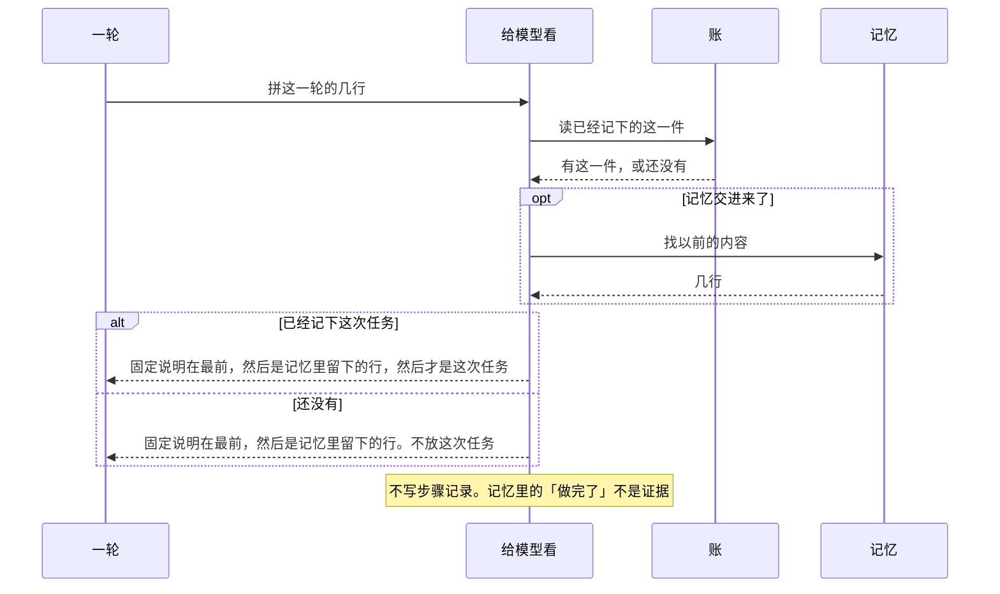

# 给模型看

总规则：[`../rewrite-1.md`](../rewrite-1.md) 第 2.6 节。一轮什么时候来问，见 [一轮.md](./一轮.md)。

本文只写 `view`。它按固定顺序拼给模型的那几行。记忆是这里的一个类。没交记忆，就不找。这几行不是记录，不能当证据。这一步不会失败，不写步骤记录。一轮把「装载」写入过程记录。

## 本文管什么

**包括**

- 固定说明永远最前，不能被拿掉。第一行是「总则」。后面四句按顺序是：做完只认这一轮里、对得上这次任务的返回，模型说做完了不算；停只认人的整段原话对上停止词表，模型说停了不算；模型自己写的完成、停止、批准，都不算数；依据只认步骤记录里已经写下的返回，记忆和转述不算。
- 交了记忆，找回来的行放在固定说明后面、这次任务前面。每一行标明不是人说的。和已经放上的一行完全相同，不再追加。和固定说明任何一句相同，或正好是「这一件」，就跳过。空行不放。
- 这次任务只有账里已经记下才放。只聊天、旁边问、字段没过，不带这次任务。
- 每次从当时的原始记录再取，不用旧副本。

**不包括**

- 记忆存在哪里、关掉以后还在不在
- 压缩那一笔。这一轮不写

## 时序

## 验收

| 编号 | 输入 | 必须看到 |
|------|------|----------|
| M-01 | 只交了记忆，找回来的是「做完了」，没有别的调用 | 给模型看的内容里有这行，并且不是人说的，排在固定说明后面。步骤记录没有做完。正文里也没有这句被当成证据 |
| M-02 | 找回来的第一行就是固定说明那句，后面还有一句新的 | 固定说明只出现一次。新的那句在。都不是人说的 |
| M-03 | 这次任务已经记下。找回来的是「这一件」，后面还有一句「别的」 | 顺序是固定说明、别的、这次任务。这次任务只出现一次，没有被挤掉 |

装载不进步骤记录，见 [一轮.md](./一轮.md) 的 V-07。本文不另写一遍。
