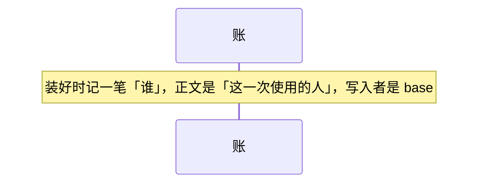
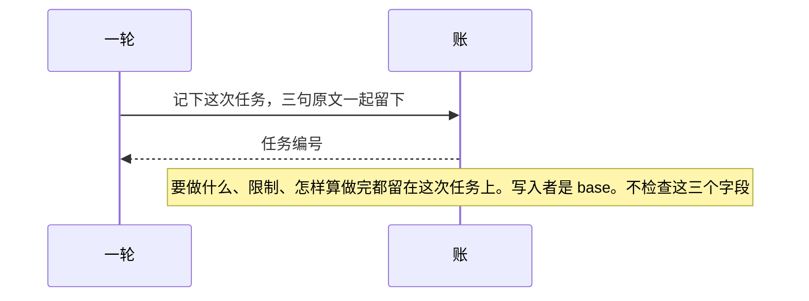

# 账

总规则：[`../rewrite-1.md`](../rewrite-1.md) 第 2.3 节。一轮什么时候来记，见 [一轮.md](./一轮.md)。

本文只写 `ledger`。它记住这一次是谁，合格之后分配任务编号，保管步骤记录。它不检查字段，不写停、拒绝、能力交回、做完。它不知道一轮怎么排。

## 本文管什么

**包括**

- 装好时记一笔「谁」，正文是「这一次使用的人」，没有登录名。写入者是 `base`。
- 一轮交来三个合格字段时，把「要做什么」「限制」「怎样算做完」的原文留在这次任务上，再分配任务编号。编号交回一轮。写入者是 `base`。判断读的就是留下的「怎样算做完」。
- 步骤记录挂在这一本账上。检查口和判断来写他们自己的那一格。账不替他们写。
- 同一时刻只允许一条追加成功。第二笔同时写，记不下来。

**不包括**

- 字段合不合格
- 四种拒绝、做完没做完
- 关机后这本账还在不在

## 时序

装好时先记人。记下任务只在三个字段合格之后，由一轮来叫。

判断来读、检查口来写，都不经过一轮转交副本。

任务编号由谁写，见 [一轮.md](./一轮.md) 的 V-05、V-13。本文不另写一遍。

## 验收

| 编号 | 输入 | 必须看到 |
|------|------|----------|
| L-01 | 这一本账刚刚装好 | 步骤记录有「谁」，正文是「这一次使用的人」，写入者是 `base`。没有登录名 |
| L-02 | 两笔同时追加 | 第二笔记不下来 |
