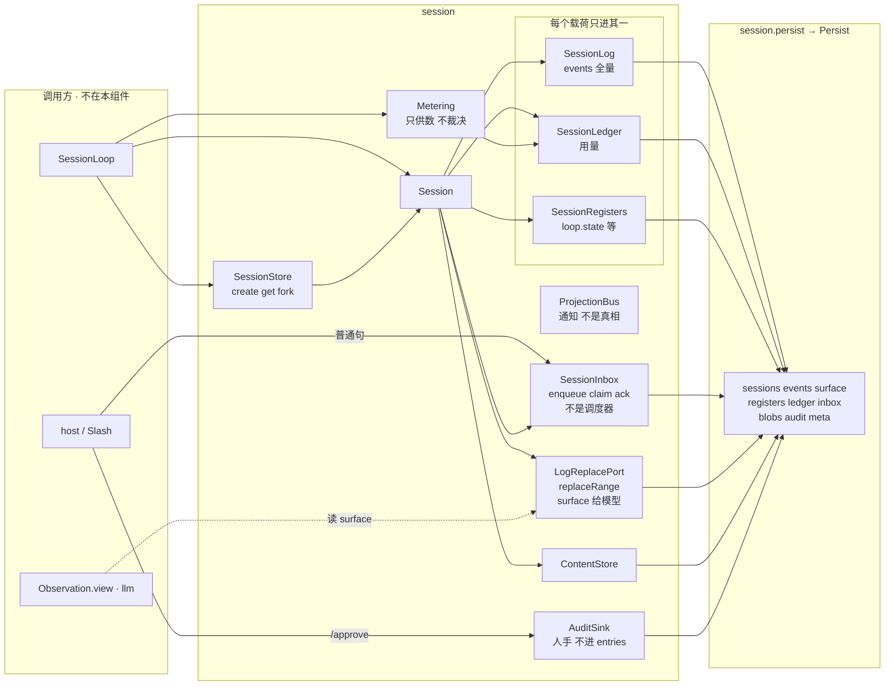
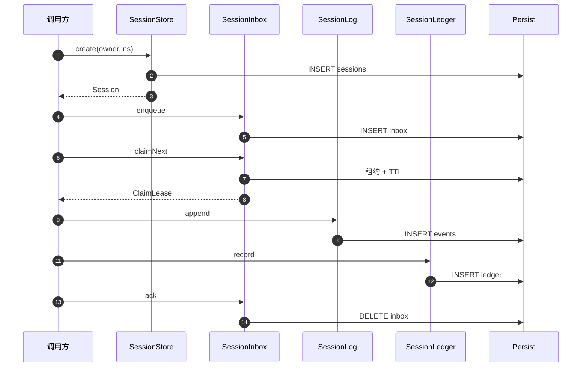

# session — 会话三 store + Inbox/claim

一件事：会话聚合口。真相分域 entries / registers / ledger，没有第四个地方。
Inbox/claim = 进场与租约，**不是**调度器。人手审计走 `AuditSink`，不进 entries。
`ProjectionBus` 是通知，完成权读 entries。适配器只认 `Persist`，不建连接、不关库。

```bash
mvn -f os/pom.xml -pl session -am test
```

## 架构

session 只暴露端口。一张会话上：三 store + Inbox + 替换面 + blobs。
`AuditSink` / `ProjectionBus` / `Metering` 挂在旁边，不是第四个真相桶。



`events` 不删。压缩只改 `surface` 序，并插 `COMPACTION_CHECKPOINT`。
`recover()` 补未配对 `TOOL_RESULT`，不截断日志。
依赖：`identity` · `syscall` · `persist/api`。sqlite 仅 test。
不做 Loop / Policy / 总线 / UI / 建连关库。

## 时序

只画 session 自己。调用方是谁（host / Loop）不在这张图里。
`AuditSink` / `ProjectionBus` / `Metering` 不在这条路上。`fork` / `recover` / `replaceRange` 另走。


